# Current Entity Relationship Diagram

This document provides the latest Entity Relationship Diagram of the SLIB system based on the current relational database structure and domain entities.

## Mermaid ERD Code

```mermaid
erDiagram
    USERS {
        UUID id PK
        VARCHAR user_code
        VARCHAR full_name
        VARCHAR email
        VARCHAR role
        BOOLEAN is_active
        INTEGER reputation_score
    }

    USER_SETTINGS {
        UUID user_id PK
        BOOLEAN is_hce_enabled
        BOOLEAN is_ai_recommend_enabled
        BOOLEAN is_booking_remind_enabled
        VARCHAR theme_mode
        VARCHAR language_code
    }

    STUDENT_PROFILES {
        UUID user_id PK
        INTEGER reputation_score
        INTEGER total_study_hours
        INTEGER violation_count
    }

    REFRESH_TOKENS {
        UUID id PK
        UUID user_id FK
        VARCHAR token_hash
        TIMESTAMP expires_at
        BOOLEAN revoked
    }

    AREAS {
        BIGINT area_id PK
        VARCHAR area_name
        INTEGER width
        INTEGER height
        BOOLEAN is_active
        BOOLEAN locked
    }

    ZONES {
        INTEGER zone_id PK
        BIGINT area_id FK
        VARCHAR zone_name
        INTEGER width
        INTEGER height
        BOOLEAN is_locked
    }

    ZONE_AMENITIES {
        INTEGER amenity_id PK
        INTEGER zone_id FK
        VARCHAR amenity_name
    }

    SEATS {
        INTEGER seat_id PK
        INTEGER zone_id FK
        VARCHAR seat_code
        VARCHAR seat_status
        UUID held_by_user FK
        VARCHAR nfc_tag_uid
    }

    LIBRARY_SETTINGS {
        INTEGER id PK
        VARCHAR open_time
        VARCHAR close_time
        INTEGER slot_duration
        INTEGER max_booking_days
        INTEGER min_reputation
        BOOLEAN library_closed
    }

    HCE_DEVICES {
        INTEGER id PK
        VARCHAR device_id
        VARCHAR device_name
        VARCHAR device_type
        VARCHAR status
        BIGINT area_id FK
    }

    RESERVATIONS {
        UUID reservation_id PK
        UUID user_id FK
        INTEGER seat_id FK
        TIMESTAMP start_time
        TIMESTAMP end_time
        TIMESTAMP actual_end_time
        VARCHAR status
    }

    ACCESS_LOGS {
        UUID log_id PK
        UUID user_id FK
        UUID reservation_id FK
        INTEGER seat_id FK
        VARCHAR device_id
        TIMESTAMP check_in_time
        TIMESTAMP check_out_time
    }

    ACTIVITY_LOGS {
        UUID id PK
        UUID user_id FK
        UUID reservation_id FK
        VARCHAR activity_type
        TEXT description
        TIMESTAMP created_at
    }

    REPUTATION_RULES {
        INTEGER id PK
        VARCHAR rule_code
        VARCHAR rule_name
        INTEGER points
        VARCHAR rule_type
        BOOLEAN is_active
    }

    POINT_TRANSACTIONS {
        UUID id PK
        UUID user_id FK
        UUID activity_log_id FK
        INTEGER rule_id FK
        INTEGER points
        VARCHAR transaction_type
        INTEGER balance_after
    }

    COMPLAINTS {
        UUID id PK
        UUID user_id FK
        UUID point_transaction_id FK
        UUID violation_report_id FK
        VARCHAR subject
        VARCHAR status
        UUID resolved_by FK
    }

    FEEDBACKS {
        UUID id PK
        UUID user_id FK
        UUID reservation_id FK
        INTEGER rating
        VARCHAR category
        VARCHAR status
        UUID reviewed_by FK
    }

    SEAT_STATUS_REPORTS {
        UUID id PK
        UUID user_id FK
        INTEGER seat_id FK
        VARCHAR issue_type
        VARCHAR status
        UUID verified_by FK
    }

    SEAT_VIOLATION_REPORTS {
        UUID id PK
        UUID reporter_id FK
        UUID violator_id FK
        INTEGER seat_id FK
        UUID reservation_id FK
        VARCHAR violation_type
        VARCHAR status
        UUID verified_by FK
    }

    NOTIFICATIONS {
        UUID id PK
        UUID user_id FK
        VARCHAR title
        VARCHAR notification_type
        BOOLEAN is_read
        UUID reference_id
    }

    NEWS_CATEGORIES {
        BIGINT id PK
        VARCHAR name
        VARCHAR color_code
    }

    NEWS {
        BIGINT id PK
        BIGINT category_id FK
        VARCHAR title
        BOOLEAN is_published
        BOOLEAN is_pinned
        INTEGER view_count
    }

    NEW_BOOKS {
        BIGINT id PK
        UUID created_by FK
        VARCHAR title
        VARCHAR author
        VARCHAR category
        BOOLEAN is_active
        BOOLEAN is_pinned
    }

    CONVERSATIONS {
        UUID id PK
        UUID student_id FK
        UUID librarian_id FK
        VARCHAR status
        VARCHAR ai_session_id
    }

    MESSAGES {
        UUID id PK
        UUID sender_id FK
        UUID receiver_id FK
        UUID conversation_id FK
        VARCHAR message_type
        BOOLEAN is_read
        TIMESTAMP created_at
    }

    SUPPORT_REQUESTS {
        UUID id PK
        UUID student_id FK
        VARCHAR status
        UUID resolved_by FK
        TIMESTAMP created_at
    }

    KIOSK_CONFIGS {
        INTEGER id PK
        VARCHAR kiosk_code
        VARCHAR kiosk_name
        VARCHAR kiosk_type
        BOOLEAN is_active
        UUID device_token_issued_by FK
    }

    KIOSK_IMAGES {
        INTEGER id PK
        VARCHAR image_name
        VARCHAR image_url
        INTEGER display_order
        BOOLEAN is_active
    }

    LIBRARY_MAPS {
        INTEGER id PK
        VARCHAR map_name
        VARCHAR map_image_url
        BOOLEAN is_active
    }

    ZONE_MAPS {
        INTEGER id PK
        INTEGER library_map_id FK
        VARCHAR zone_name
        VARCHAR zone_type
        INTEGER x_position
        INTEGER y_position
    }

    KIOSK_QR_SESSIONS {
        INTEGER id PK
        INTEGER kiosk_id FK
        UUID student_id FK
        UUID access_log_id FK
        VARCHAR session_token
        VARCHAR status
    }

    KIOSK_ACTIVATION_CODES {
        INTEGER id PK
        INTEGER kiosk_id FK
        VARCHAR code
        TIMESTAMP expires_at
        BOOLEAN used
    }

    AI_KNOWLEDGE_STORES {
        BIGINT id PK
        VARCHAR name
        VARCHAR store_type
        VARCHAR status
        INTEGER document_count
    }

    AI_MATERIALS {
        BIGINT id PK
        BIGINT knowledge_store_id FK
        VARCHAR name
        BOOLEAN is_active
    }

    AI_MATERIAL_ITEMS {
        BIGINT id PK
        BIGINT material_id FK
        VARCHAR name
        VARCHAR type
        VARCHAR file_name
    }

    CHAT_SESSIONS {
        UUID id PK
        UUID user_id FK
        VARCHAR title
        BOOLEAN is_active
    }

    CHAT_MESSAGES {
        UUID id PK
        UUID session_id FK
        VARCHAR role
        INTEGER tokens_used
        TIMESTAMP created_at
    }

    KNOWLEDGE_BASE {
        BIGINT id PK
        VARCHAR title
        VARCHAR category
        VARCHAR type
        BOOLEAN is_active
    }

    PROMPT_TEMPLATES {
        BIGINT id PK
        VARCHAR name
        VARCHAR context
        BOOLEAN is_active
    }

    STUDENT_BEHAVIORS {
        INTEGER id PK
        UUID user_id FK
        UUID related_booking_id FK
        INTEGER related_seat_id FK
        INTEGER related_zone_id FK
        VARCHAR behavior_type
        INTEGER points_impact
    }

    BACKUP_SCHEDULES {
        INTEGER id PK
        BOOLEAN enabled
        VARCHAR frequency
        VARCHAR backup_time
        INTEGER retain_days
    }

    BACKUP_HISTORY {
        INTEGER id PK
        INTEGER schedule_id FK
        UUID created_by FK
        VARCHAR status
        TIMESTAMP created_at
    }

    SYSTEM_LOGS {
        UUID id PK
        UUID user_id FK
        VARCHAR level
        VARCHAR service
        VARCHAR action
        VARCHAR entity_type
        TIMESTAMP created_at
    }

    LAYOUT_DRAFTS {
        BIGINT draft_id PK
        UUID updated_by_user_id FK
        BIGINT based_on_published_version
        TIMESTAMP updated_at
    }

    LAYOUT_HISTORY {
        BIGINT history_id PK
        UUID created_by_user_id FK
        VARCHAR action_type
        BIGINT published_version
        TIMESTAMP created_at
    }

    USERS ||--|| USER_SETTINGS : has
    USERS ||--|| STUDENT_PROFILES : has
    USERS ||--o{ REFRESH_TOKENS : owns
    USERS ||--o{ RESERVATIONS : creates
    USERS ||--o{ ACCESS_LOGS : appears_in
    USERS ||--o{ ACTIVITY_LOGS : generates
    USERS ||--o{ POINT_TRANSACTIONS : receives
    USERS ||--o{ NOTIFICATIONS : receives
    USERS ||--o{ FEEDBACKS : submits
    USERS ||--o{ FEEDBACKS : reviews
    USERS ||--o{ SEAT_STATUS_REPORTS : submits
    USERS ||--o{ SEAT_STATUS_REPORTS : verifies
    USERS ||--o{ SEAT_VIOLATION_REPORTS : reports
    USERS ||--o{ SEAT_VIOLATION_REPORTS : violates
    USERS ||--o{ SEAT_VIOLATION_REPORTS : verifies
    USERS ||--o{ COMPLAINTS : submits
    USERS ||--o{ COMPLAINTS : resolves
    USERS ||--o{ CONVERSATIONS : starts
    USERS ||--o{ CONVERSATIONS : handles
    USERS ||--o{ MESSAGES : sends
    USERS ||--o{ MESSAGES : receives
    USERS ||--o{ SUPPORT_REQUESTS : submits
    USERS ||--o{ SUPPORT_REQUESTS : resolves
    USERS ||--o{ NEW_BOOKS : creates
    USERS ||--o{ CHAT_SESSIONS : owns
    USERS ||--o{ STUDENT_BEHAVIORS : has
    USERS ||--o{ BACKUP_HISTORY : triggers
    USERS ||--o{ SYSTEM_LOGS : creates
    USERS ||--o{ KIOSK_CONFIGS : issues
    USERS ||--o{ KIOSK_QR_SESSIONS : scans
    USERS ||--o{ LAYOUT_DRAFTS : updates
    USERS ||--o{ LAYOUT_HISTORY : publishes

    AREAS ||--o{ ZONES : contains
    AREAS ||--o{ HCE_DEVICES : hosts
    ZONES ||--o{ ZONE_AMENITIES : has
    ZONES ||--o{ SEATS : contains
    ZONES ||--o{ STUDENT_BEHAVIORS : relates_to
    SEATS ||--o{ RESERVATIONS : booked_for
    SEATS ||--o{ ACCESS_LOGS : used_in
    SEATS ||--o{ SEAT_STATUS_REPORTS : reported_for
    SEATS ||--o{ SEAT_VIOLATION_REPORTS : violated_at
    SEATS ||--o{ STUDENT_BEHAVIORS : relates_to

    RESERVATIONS ||--o{ ACCESS_LOGS : produces
    RESERVATIONS ||--o{ ACTIVITY_LOGS : generates
    RESERVATIONS ||--o{ FEEDBACKS : receives
    RESERVATIONS ||--o{ SEAT_VIOLATION_REPORTS : linked_to
    RESERVATIONS ||--o{ STUDENT_BEHAVIORS : relates_to

    REPUTATION_RULES ||--o{ POINT_TRANSACTIONS : applies_to
    ACTIVITY_LOGS ||--o{ POINT_TRANSACTIONS : causes
    POINT_TRANSACTIONS ||--o{ COMPLAINTS : disputed_by

    NEWS_CATEGORIES ||--o{ NEWS : classifies
    CONVERSATIONS ||--o{ MESSAGES : contains

    LIBRARY_MAPS ||--o{ ZONE_MAPS : contains
    KIOSK_CONFIGS ||--o{ KIOSK_QR_SESSIONS : creates
    KIOSK_CONFIGS ||--o{ KIOSK_ACTIVATION_CODES : issues
    ACCESS_LOGS ||--o{ KIOSK_QR_SESSIONS : attached_to

    AI_KNOWLEDGE_STORES ||--o{ AI_MATERIALS : contains
    AI_MATERIALS ||--o{ AI_MATERIAL_ITEMS : contains
    CHAT_SESSIONS ||--o{ CHAT_MESSAGES : contains
    BACKUP_SCHEDULES ||--o{ BACKUP_HISTORY : records
```

## Notes

- This ERD focuses on the current main relational entities of the system instead of listing every low-level technical table field in full detail.
- It is derived from the latest PostgreSQL schema and current business entities used by the backend.
- Some soft references such as polymorphic notification targets are intentionally simplified to keep the diagram readable for report usage.
