# Librarian Website Screen Flow Diagram

```mermaid
---
config:
  layout: elk
---
flowchart LR
 subgraph mainnav["Librarian route screens"]
        checkinout["Check-In / Check-Out Screen"]
        dashboard["Librarian Dashboard"]
        seatmanage["Seat and Area Management Screen"]
        bookings["Booking Management Screen"]
        students["Student Management Screen"]
        violation["Violation Management Screen"]
        support["Support Request Management Screen"]
        complaints["Complaint Management Screen"]
        seatreports["Seat Status Report Management Screen"]
        feedback["Feedback Management Screen"]
        chat["Chat Management Screen"]
        statistic["Statistics Screen"]
        news["News & Announcement List Screen"]
        newsCreate["Create News Screen"]
        newsEdit["Edit News Screen"]
        newsView["News Detail View Screen"]
        newBooks["New Book List Screen"]
        newBookCreate["Create New Book Screen"]
        newBookEdit["Edit New Book Screen"]
        slideManage["Kiosk Slideshow Management Screen"]
        slidePreview["Kiosk Slideshow Preview Screen"]
        attendance["Attendance Waiting Screen"]
        settings["Account Settings Screen"]
  end
 subgraph dashboardflow["Dashboard widgets and modal flows"]
        dashStudentModal["Student Detail Modal"]
        dashBookingModal["Booking Detail Modal"]
        dashViolationModal["Violation Detail Modal"]
        dashSupportModal["Support Request Detail Modal"]
        dashComplaintModal["Complaint Detail Modal"]
        dashFeedbackModal["Feedback Detail Modal"]
        dashNewsModal["News Detail Modal"]
  end
 subgraph checkinflow["Check-in and access monitoring flow"]
        accessFilter["Date / Status Filter Panel"]
        accessDetail["Access Log Detail Modal"]
        accessRealtime["Realtime Access Update State"]
  end
 subgraph seatflow["Seat and area monitoring flow"]
        areaCanvas["Area Canvas / Zone Map"]
        seatLegend["Seat Status Legend Dialog"]
        seatFilter["Area / Slot / Status Filter"]
        seatDetail["Zone Detail / Seat Detail Panel"]
        seatAction["Seat Action Popup"]
  end
    entry["Open SLIB Web"] --> auth{"Authenticated session?"}
    auth -- No --> login["Unified Login Screen\nAuthPage / Login form"]
    login --> forgot["Forgot Password Screen / Panel"] & errSession["Session Expired Screen"] & errToken["Token Expired Screen"] & errForbidden["Forbidden Screen"] & errServer["Server Error Screen"] & errTimeout["Session Timeout Screen"] & err404["Not Found Screen"]
    forgot --> login
    login -- Librarian login success --> dashboard
    auth -- Yes --> dashboard
    dashboard --> checkinout & seatmanage & bookings & students & violation & support & complaints & seatreports & feedback & chat & statistic & news & newsCreate & newsEdit & newsView & newBooks & newBookCreate & newBookEdit & slideManage & slidePreview & attendance & settings & dashStudentModal & dashBookingModal & dashViolationModal & dashSupportModal & dashComplaintModal & dashFeedbackModal & dashNewsModal
    checkinout --> accessFilter & accessDetail & accessRealtime
    accessDetail --> checkinout
    seatmanage --> areaCanvas & seatLegend & seatFilter & seatDetail & seatAction
    seatDetail --> seatAction
    seatAction --> seatmanage
    subgraph bookingflow["Booking operation flow"]
        bookings --> bookingFilter["Search / Filter / Column Menu"]
        bookings --> bookingDetail["Booking Detail Modal"]
        bookings --> releaseSeat["Release Occupied Seat Confirm Dialog"]
        bookings --> manualLeave["Manual Leave / End Booking Action"]
        bookingDetail --> bookings
        releaseSeat --> bookings
        manualLeave --> bookings
    end

    subgraph studentflow["Student management flow"]
        students --> studentFilter["Search / Filter / View Mode"]
        students --> studentDetail["Student Detail Modal"]
        studentDetail --> students
    end

    subgraph violationflow["Violation and complaint handling flow"]
        violation --> violationFilter["Filter / Table-Card View / Column Menu"]
        violation --> violationDetail["Violation Detail Modal"]
        violation --> verifyViolation["Verify / Resolve Violation Dialog"]
        complaints --> complaintFilter["Filter / Table-Card View / Column Menu"]
        complaints --> complaintDetail["Complaint Detail Modal"]
        complaintDetail --> acceptComplaint["Accept Complaint Confirm"]
        complaintDetail --> denyComplaint["Deny Complaint Confirm"]
        acceptComplaint --> complaints
        denyComplaint --> complaints
        violationDetail --> violation
    end

    subgraph supportflow["Support and report handling flow"]
        support --> supportFilter["Filter / Table-Card View / Column Menu"]
        support --> supportDetail["Support Request Detail Modal"]
        supportDetail --> manualReply["Manual Reply Action"]
        seatreports --> seatReportFilter["Filter / Table-Card View / Column Menu"]
        seatreports --> seatReportDetail["Seat Status Report Detail Modal"]
        seatReportDetail --> verifySeatReport["Verify Seat Status Report Action"]
        feedback --> feedbackFilter["Filter / Table-Card View / Column Menu"]
        feedback --> feedbackDetail["Feedback Detail Modal"]
        feedbackDetail --> markReviewed["Mark as Reviewed Action"]
        manualReply --> support
        verifySeatReport --> seatreports
        markReviewed --> feedback
    end

    subgraph chatflow["Chat management flow"]
        chat --> chatTabs["Conversation Tabs / Partner List / Active Chat"]
        chat --> chatInfo["Right Sidebar Conversation Info"]
        chat --> chatImage["Full Image Preview Modal"]
        chat --> chatToast["Escalation / New Message Toast"]
        chatTabs --> chatInfo
        chatInfo --> chat
        chatImage --> chat
    end

    subgraph statflow["Statistics and analytics flow"]
        statistic --> chartCards["Analytics Dashboard Widgets"]
        statistic --> aiPanel["AI Analytics Panel"]
        aiPanel --> aiPriorityModal["AI Prioritized Students Detail Modal"]
        aiPanel --> aiWarningDialog["Send Warning Confirmation Dialog"]
        aiPriorityModal --> statistic
        aiWarningDialog --> statistic
    end

    subgraph contentflow["Content management flow"]
        news --> newsFilter["Category / Status / Schedule Filter"]
        news --> categoryCreate["Create Category Dialog"]
        news --> deleteNews["Delete News Confirm"]
        newsCreate --> newsDraft["Save Draft Action"]
        newsCreate --> newsSchedule["Schedule Publish Dialog"]
        newsEdit --> newsDraft
        newsEdit --> newsSchedule
        newsView --> news
        newBooks --> bookFilter["Search / Filter / Status"]
        newBooks --> deleteBook["Delete New Book Confirm"]
        slideManage --> uploadSlide["Upload Image Modal"]
        slideManage --> imagePreview["Image Preview Modal"]
        slideManage --> inlineEdit["Inline Edit Row State"]
        slideManage --> activeToggle["Activate / Deactivate Image Action"]
        slideManage --> batchDelete["Batch Delete Confirm"]
        slideManage --> batchActivate["Batch Activate / Deactivate Action"]
        slidePreview --> slideManage
    end

    subgraph headerflow["Global header and notification flow"]
        dashboard --> notificationDropdown["Notification Dropdown"]
        notificationDropdown --> chat
        notificationDropdown --> support
        notificationDropdown --> complaints
        notificationDropdown --> seatreports
        notificationDropdown --> feedback
        notificationDropdown --> violation
        notificationDropdown --> bookings
        notificationDropdown --> newsView
        dashboard --> accountDropdown["Account Dropdown"]
        accountDropdown --> settings
        accountDropdown --> logoutConfirm["Logout Confirm Dialog"]
    end

    settings --> logoutConfirm
    logoutConfirm -->|Confirm| login
    logoutConfirm -->|Cancel| settings

    classDef startEnd fill:#e8600a,color:#ffffff,stroke:#b84b05,stroke-width:2px;
    classDef auth fill:#fff1e8,color:#7a3412,stroke:#f59e0b,stroke-width:1.5px;
    classDef route fill:#dbeafe,color:#1e3a8a,stroke:#60a5fa,stroke-width:1.5px;
    classDef modal fill:#f5f3ff,color:#5b21b6,stroke:#a78bfa,stroke-width:1.5px;
    classDef action fill:#ecfdf5,color:#065f46,stroke:#34d399,stroke-width:1.5px;
    classDef warn fill:#fee2e2,color:#991b1b,stroke:#f87171,stroke-width:1.5px;
    classDef content fill:#fef3c7,color:#92400e,stroke:#fbbf24,stroke-width:1.5px;

    class entry,logoutConfirm startEnd;
    class auth,login,forgot,errSession,errToken,errForbidden,errServer,errTimeout,err404 auth;
    class dashboard,checkinout,seatmanage,bookings,students,violation,support,complaints,seatreports,feedback,chat,statistic,news,newsCreate,newsEdit,newsView,newBooks,newBookCreate,newBookEdit,slideManage,slidePreview,attendance,settings route;
    class dashStudentModal,dashBookingModal,dashViolationModal,dashSupportModal,dashComplaintModal,dashFeedbackModal,dashNewsModal,accessDetail,seatLegend,seatDetail,seatAction,bookingDetail,studentDetail,violationDetail,complaintDetail,supportDetail,seatReportDetail,feedbackDetail,chatInfo,chatImage,aiPriorityModal,imagePreview,uploadSlide,categoryCreate modal;
    class accessFilter,accessRealtime,areaCanvas,seatFilter,bookingFilter,releaseSeat,manualLeave,studentFilter,violationFilter,verifyViolation,complaintFilter,acceptComplaint,denyComplaint,supportFilter,manualReply,seatReportFilter,verifySeatReport,feedbackFilter,markReviewed,chatTabs,chatToast,chartCards,aiPanel,aiWarningDialog,newsFilter,newsDraft,newsSchedule,bookFilter,inlineEdit,activeToggle,batchDelete,batchActivate,notificationDropdown,accountDropdown action;
    class deleteNews,deleteBook warn;
```

## Notes

- This diagram follows the current route structure in `frontend/src/routes/LibrarianRoutes.jsx` and the embedded modal flows found in librarian pages and shared components.
- Route-based screens, in-page modals, preview windows, filter panels, and confirm dialogs are all modeled because they are part of the current UI behavior.
- Kiosk public screens are not included here because they are not part of the Librarian website flow itself.
