# Librarian Website Screen Flow Diagram

```mermaid
flowchart TB
    start["Start accessing SLIB Web"] --> auth{"Already signed in?"}
    auth -->|No| login["Staff Login Screen<br/>AuthPage / Login"]
    login --> forgot["Forgot Password"]
    forgot --> login
    login -->|Login successful as LIBRARIAN| dash["Librarian Dashboard"]
    auth -->|Yes| dash

    subgraph core["Main navigation flow of the Librarian Website"]
        dash --> checkio["Check-in / Check-out"]
        dash --> seatmanage["Seat and Area Management"]
        dash --> bookings["Booking Management"]
        dash --> students["Student Management"]
        dash --> violation["Violation Management"]
        dash --> support["Support Request Management"]
        dash --> complaints["Complaint Management"]
        dash --> seatreports["Seat Status Report Management"]
        dash --> feedback["Feedback Management"]
        dash --> chat["Student Chat Management"]
        dash --> stats["Statistics"]
        dash --> news["News / Announcement Management"]
        dash --> newbooks["New Book Management"]
        dash --> slideshow["Kiosk Slideshow Management"]
        dash --> settings["Account Settings"]
    end

    subgraph checkio_flow["Monitoring and operation flow"]
        checkio --> attendance["Attendance / Waiting Screen"]
        seatmanage --> zoneSeatDetail["Area / Seat / Seat Status Detail"]
        bookings --> bookingDetail["Booking Detail / Filter / Manual Confirmation"]
        students --> studentDetail["Student Detail"]
        violation --> violationDetail["Violation Detail / Resolution"]
        support --> supportDetail["Support Request Detail / Response"]
        complaints --> complaintDetail["Complaint Detail / Status Update"]
        seatreports --> seatReportDetail["Seat Report Detail / Verification / Resolution"]
        feedback --> feedbackDetail["Feedback Detail"]
    end

    subgraph content_flow["Content management flow"]
        news --> newsCreate["Create News / Announcement"]
        news --> newsEdit["Edit News / Announcement"]
        news --> newsView["View News Detail"]
        newsCreate --> news
        newsEdit --> news
        newsView --> news

        newbooks --> newBookCreate["Create New Book"]
        newbooks --> newBookEdit["Edit New Book"]
        newBookCreate --> newbooks
        newBookEdit --> newbooks

        slideshow --> slideshowPreview["Preview Slideshow"]
        slideshowPreview --> slideshow
    end

    subgraph realtime_flow["Navigation from the real-time notification header"]
        bell["Librarian Notification Bell"] --> chat
        bell --> support
        bell --> complaints
        bell --> feedback
        bell --> seatreports
        bell --> violation
        chat --> chatConv["Open conversation by conversationId"]
        support --> supportFiltered["Open PENDING tab"]
        complaints --> complaintFiltered["Open PENDING tab"]
        feedback --> feedbackFiltered["Open NEW tab"]
        seatreports --> seatReportFiltered["Open PENDING status"]
        violation --> violationFiltered["Open PENDING tab"]
    end

    stats --> aiPanel["AI Analytics Panel"]
    aiPanel --> stats

    settings --> logout{"Log out?"}
    logout -->|Yes| login
    logout -->|No| settings

    bookingDetail --> bookings
    studentDetail --> students
    violationDetail --> violation
    supportDetail --> support
    complaintDetail --> complaints
    seatReportDetail --> seatreports
    feedbackDetail --> feedback
    chatConv --> chat
    zoneSeatDetail --> seatmanage

    classDef startEnd fill:#e8600a,color:#ffffff,stroke:#b84b05,stroke-width:2px;
    classDef authFlow fill:#fff1e8,color:#7a3412,stroke:#f59e0b,stroke-width:1.5px;
    classDef dashboard fill:#dbeafe,color:#1e3a8a,stroke:#60a5fa,stroke-width:1.5px;
    classDef mainFlow fill:#ecfdf5,color:#065f46,stroke:#34d399,stroke-width:1.5px;
    classDef detailFlow fill:#f5f3ff,color:#5b21b6,stroke:#a78bfa,stroke-width:1.5px;
    classDef contentFlow fill:#fef3c7,color:#92400e,stroke:#fbbf24,stroke-width:1.5px;
    classDef alertFlow fill:#fee2e2,color:#991b1b,stroke:#f87171,stroke-width:1.5px;
    classDef analyticsFlow fill:#e0f2fe,color:#0c4a6e,stroke:#38bdf8,stroke-width:1.5px;

    class start,login,forgot,logout startEnd;
    class auth authFlow;
    class dash dashboard;
    class checkio,seatmanage,bookings,students,violation,support,complaints,seatreports,feedback,chat,stats,news,newbooks,slideshow,settings,attendance mainFlow;
    class zoneSeatDetail,bookingDetail,studentDetail,violationDetail,supportDetail,complaintDetail,seatReportDetail,feedbackDetail,chatConv,supportFiltered,complaintFiltered,feedbackFiltered,seatReportFiltered,violationFiltered detailFlow;
    class newsCreate,newsEdit,newsView,newBookCreate,newBookEdit,slideshowPreview contentFlow;
    class bell alertFlow;
    class aiPanel analyticsFlow;
```

## Notes

- This diagram follows the current routes in `frontend/src/routes/LibrarianRoutes.jsx` and the navigation triggers in `layouts/librarian/MainLayout.jsx`.
- `news/create`, `news/edit/:id`, `news/view/:id`, `new-books/create`, `new-books/edit/:id`, `slideshow-preview`, and `attendance` are separate route-based screens.
- Detail views such as student detail, support request detail, and seat report detail are currently opened mostly inside the same page or through modals, so they are modeled here as child business flows of their corresponding management screens.
