# Admin Website Screen Flow Diagram

```mermaid
flowchart TB
    start["Start accessing SLIB Web"] --> auth{"Already signed in?"}
    auth -->|No| login["Staff Login Screen<br/>AuthPage / Login"]
    login --> forgot["Forgot Password"]
    forgot --> login
    login -->|Login successful as ADMIN| dash["Admin Dashboard"]
    auth -->|Yes| dash

    subgraph admin_core["Main navigation flow of the Admin Website"]
        dash --> libraryMap["Library Map Management"]
        dash --> users["User Management"]
        dash --> devices["HCE Device / Station Management"]
        dash --> nfc["NFC Tag Management"]
        dash --> kiosk["Kiosk Management"]
        dash --> config["System / Library Configuration"]
        dash --> health["System Health"]
        dash --> ai["AI Configuration"]
        dash --> settings["Account Settings"]
    end

    subgraph map_flow["Library configuration flow"]
        libraryMap --> areaEditor["Design Area / Zone / Seat / Factory / Amenity"]
        areaEditor --> libraryMap
        config --> systemRules["Configure Opening Hours, Booking Rules, and System Parameters"]
        systemRules --> config
    end

    subgraph user_flow["User administration flow"]
        users --> userDetail["View User Detail"]
        users --> importUsers["Import Users from File"]
        users --> templateDownload["Download Import Template"]
        users --> addLibrarian["Add Librarian"]
        users --> changeStatus["Change Account Status"]
        users --> deleteUser["Delete Account"]
        userDetail --> users
        importUsers --> users
        templateDownload --> users
        addLibrarian --> users
        changeStatus --> users
        deleteUser --> users
    end

    subgraph infra_flow["Infrastructure and kiosk flow"]
        devices --> stationDetail["Device Detail / Heartbeat Status"]
        stationDetail --> devices
        nfc --> nfcMapping["Map NFC Tag to Seat / Verify Mapping"]
        nfcMapping --> nfc
        kiosk --> kioskSession["Kiosk Activation Session Management"]
        kiosk --> kioskSlides["Kiosk Slideshow Management"]
        kioskSession --> kiosk
        kioskSlides --> kiosk
    end

    subgraph ai_flow["AI administration flow"]
        ai --> promptTemplate["Prompt Template"]
        ai --> knowledgeBase["Knowledge Base"]
        ai --> materialStore["Documents / Materials"]
        ai --> analyticsProxy["AI Analytics / Data Sync"]
        promptTemplate --> ai
        knowledgeBase --> ai
        materialStore --> ai
        analyticsProxy --> ai
    end

    health --> monitor["View Health Check / Service Status"]
    monitor --> health

    settings --> logout{"Log out?"}
    logout -->|Yes| login
    logout -->|No| settings

    classDef startEnd fill:#e8600a,color:#ffffff,stroke:#b84b05,stroke-width:2px;
    classDef authFlow fill:#fff1e8,color:#7a3412,stroke:#f59e0b,stroke-width:1.5px;
    classDef dashboard fill:#dbeafe,color:#1e3a8a,stroke:#60a5fa,stroke-width:1.5px;
    classDef mainFlow fill:#ecfdf5,color:#065f46,stroke:#34d399,stroke-width:1.5px;
    classDef configFlow fill:#fef3c7,color:#92400e,stroke:#fbbf24,stroke-width:1.5px;
    classDef detailFlow fill:#f5f3ff,color:#5b21b6,stroke:#a78bfa,stroke-width:1.5px;
    classDef infraFlow fill:#fee2e2,color:#991b1b,stroke:#f87171,stroke-width:1.5px;
    classDef aiFlow fill:#e0f2fe,color:#0c4a6e,stroke:#38bdf8,stroke-width:1.5px;

    class start,login,forgot,logout startEnd;
    class auth authFlow;
    class dash dashboard;
    class libraryMap,users,devices,nfc,kiosk,config,health,ai,settings mainFlow;
    class areaEditor,systemRules,importUsers,templateDownload,addLibrarian,changeStatus,deleteUser configFlow;
    class userDetail,stationDetail,nfcMapping,kioskSession,kioskSlides,monitor detailFlow;
    class devices,nfc,kiosk infraFlow;
    class promptTemplate,knowledgeBase,materialStore,analyticsProxy aiFlow;
```

## Notes

- This diagram follows the current routes in `frontend/src/routes/AdminRoutes.jsx`.
- The Admin side currently has fewer separate detail routes than the Librarian side; most subflows happen inside each management page or inside modal interactions.
- `library-map`, `users`, `devices`, `nfc-management`, `kiosk`, `config`, `health`, `ai-config`, and `settings` are the current real route-based screens in the codebase.
