# Admin Website Screen Flow Diagram

```mermaid
---
config:
  layout: elk
---
flowchart LR
 subgraph routes["Admin route screens"]
        libraryMap["Library Map Management Screen"]
        dashboard["Admin Dashboard"]
        users["User Management Screen"]
        devices["HCE Scan Station Management Screen"]
        nfc["NFC Tag Management Screen"]
        kiosk["Kiosk Device Management Screen"]
        config["System Configuration Screen"]
        health["System Health Screen"]
        aiConfig["AI Configuration Screen"]
        settings["Account Settings Screen"]
  end
 subgraph dashflow["Dashboard flow"]
        summaryCards["System Summary Widgets"]
        quickNav["Quick Navigation Tiles"]
  end
 subgraph mapflow["Library map editor flow"]
        mapCanvas["Layout Canvas Board"]
        areaProps["Area Properties Panel"]
        zoneProps["Zone Properties Panel"]
        seatProps["Seat Properties Panel"]
        factoryProps["Factory / Shape Properties Panel"]
        amenityEditor["Amenity Editor State"]
        previewMode["Preview Mode"]
        publishDraft["Save / Publish Layout Action"]
  end
 subgraph userflow["User management flow"]
        userSearch["Search / Filter / Pagination"]
        addLibrarian["Add Librarian Modal"]
        importModal["Import Users Modal"]
        downloadTemplate["Download Template Action"]
        userDetail["User Details Modal\nInfo / Stats / History tabs"]
        changeStatus["Change Status Confirm Dialog"]
        deleteUser["Delete User Modal"]
  end
 subgraph deviceflow["HCE station flow"]
        deviceFilter["Search / Type / Status Filter"]
        deviceDetail["Device Detail Modal / Panel"]
        registerDevice["Register / Create Station Dialog"]
        editDevice["Update Station Dialog"]
        deleteDevice["Delete Station Confirm Dialog"]
        heartbeatState["Realtime Heartbeat / Status State"]
  end
    entry["Open SLIB Web"] --> auth{"Authenticated session?"}
    auth -- No --> login["Unified Login Screen\nAuthPage / Login form"]
    login --> forgot["Forgot Password Screen / Panel"] & errSession["Session Expired Screen"] & errToken["Token Expired Screen"] & errForbidden["Forbidden Screen"] & errServer["Server Error Screen"] & errTimeout["Session Timeout Screen"] & err404["Not Found Screen"]
    forgot --> login
    login -- Admin login success --> dashboard
    auth -- Yes --> dashboard
    dashboard --> libraryMap & users & devices & nfc & kiosk & config & health & aiConfig & settings & summaryCards & quickNav
    libraryMap --> mapCanvas & areaProps & zoneProps & seatProps & factoryProps & amenityEditor & previewMode & publishDraft
    users --> userSearch & addLibrarian & importModal & downloadTemplate & userDetail & changeStatus & deleteUser
    userDetail --> users
    addLibrarian --> users
    importModal --> users
    changeStatus --> users
    deleteUser --> users
    devices --> deviceFilter & deviceDetail & registerDevice & editDevice & deleteDevice & heartbeatState
    deviceDetail --> devices
    subgraph nfcflow["NFC management flow"]
        nfc --> nfcMap["NFC Seat Map Screen State"]
        nfc --> bridgeDropdown["Bridge Action Dropdown"]
        nfc --> bridgeGuide["Bridge Guide Modal"]
        nfc --> seatInfo["Seat NFC Detail Modal"]
        nfc --> nfcCheck["NFC Scan / Verify Modal"]
        nfc --> bindTag["Bind / Update Tag Action"]
        nfc --> removeTag["Delete Mapping Confirm Dialog"]
        seatInfo --> bindTag
        nfcCheck --> nfc
    end

    subgraph kioskflow["Kiosk administration flow"]
        kiosk --> kioskList["Kiosk Device List"]
        kiosk --> kioskDetail["Kiosk Device Detail Panel"]
        kiosk --> kioskCreate["Create Kiosk Dialog"]
        kiosk --> kioskEdit["Update Kiosk Dialog"]
        kiosk --> kioskDelete["Delete Kiosk Confirm Dialog"]
        kiosk --> kioskActivate["Activate Kiosk Dialog / Code Flow"]
        kiosk --> kioskToken["Token / QR Session State"]
        kioskDetail --> kiosk
    end

    subgraph configflow["System configuration flow"]
        config --> areaConfig["Area / Zone / Seat rules section"]
        config --> reputationConfig["Reputation Rule section"]
        config --> bookingRules["Booking Rules section"]
        config --> autoCheckout["Automatic Check-Out Time section"]
        config --> libraryStatus["Enable / Disable Library section"]
        config --> notificationConfig["System Notification section"]
        config --> backupConfig["Backup Schedule section"]
        config --> saveConfig["Save Configuration Confirm / Success"]
    end

    subgraph healthflow["System health flow"]
        health --> healthCards["Service Health Cards"]
        health --> logTable["System Log Table"]
        health --> logFilter["Level / Source / Search Filter"]
        health --> backupManual["Manual Backup Action"]
        health --> backupHistory["Backup History View"]
        health --> backupResult["Backup Result Dialog / Toast"]
    end

    subgraph aiflow["AI configuration flow"]
        aiConfig --> materialList["Material List"]
        aiConfig --> materialForm["Create / Update Material Dialog"]
        aiConfig --> materialDelete["Delete Material Confirm"]
        aiConfig --> storeList["Knowledge Store List"]
        aiConfig --> storeForm["Create / Update Store Dialog"]
        aiConfig --> storeDelete["Delete Store Confirm"]
        aiConfig --> testChat["AI Chat Test Panel"]
        aiConfig --> syncState["Sync / Processing State"]
    end

    subgraph globalflow["Global header and account flow"]
        dashboard --> profileMenu["Account Dropdown"]
        profileMenu --> settings
        profileMenu --> logoutConfirm["Logout Confirm Dialog"]
    end

    settings --> logoutConfirm
    logoutConfirm -->|Confirm| login
    logoutConfirm -->|Cancel| settings

    classDef startEnd fill:#e8600a,color:#ffffff,stroke:#b84b05,stroke-width:2px;
    classDef auth fill:#fff1e8,color:#7a3412,stroke:#f59e0b,stroke-width:1.5px;
    classDef route fill:#dbeafe,color:#1e3a8a,stroke:#60a5fa,stroke-width:1.5px;
    classDef panel fill:#ecfdf5,color:#065f46,stroke:#34d399,stroke-width:1.5px;
    classDef modal fill:#f5f3ff,color:#5b21b6,stroke:#a78bfa,stroke-width:1.5px;
    classDef warn fill:#fee2e2,color:#991b1b,stroke:#f87171,stroke-width:1.5px;
    classDef configstyle fill:#fef3c7,color:#92400e,stroke:#fbbf24,stroke-width:1.5px;

    class entry,logoutConfirm startEnd;
    class auth,login,forgot,errSession,errToken,errForbidden,errServer,errTimeout,err404 auth;
    class dashboard,libraryMap,users,devices,nfc,kiosk,config,health,aiConfig,settings route;
    class summaryCards,quickNav,mapCanvas,areaProps,zoneProps,seatProps,factoryProps,amenityEditor,previewMode,publishDraft,userSearch,downloadTemplate,deviceFilter,heartbeatState,nfcMap,bridgeDropdown,bindTag,kioskList,kioskToken,areaConfig,reputationConfig,bookingRules,autoCheckout,libraryStatus,notificationConfig,backupConfig,saveConfig,healthCards,logTable,logFilter,backupManual,backupHistory,backupResult,materialList,storeList,testChat,syncState,panel,profileMenu panel;
    class addLibrarian,importModal,userDetail,changeStatus,deleteUser,deviceDetail,registerDevice,editDevice,deleteDevice,bridgeGuide,seatInfo,nfcCheck,kioskDetail,kioskCreate,kioskEdit,kioskDelete,kioskActivate,materialForm,storeForm,settings modal;
    class removeTag,materialDelete,storeDelete warn;
```

## Notes

- This diagram follows the current route structure in `frontend/src/routes/AdminRoutes.jsx` and the in-page modal flows found in Admin pages and Admin components.
- The Admin website has fewer standalone routes than the Librarian site, so many important UI screens exist as modals, drawers, editor panels, and confirm dialogs inside each main page.
- Kiosk public screens are excluded here because they belong to the public kiosk flow, not the Admin website flow.
