# Student and Teacher Mobile Screen Flow Diagram

```mermaid
---
config:
  layout: elk
---
flowchart LR
 subgraph maintabs["Main mobile tabs"]
        home["Home Tab"]
        main["Main Screen"]
        floorPlan["Floor Plan Tab"]
        card["Student / Teacher Card Tab"]
        chat["Chat Tab"]
        setting["Account & Settings Tab"]
  end
 subgraph homeflow["Home tab flow"]
        homeNotification["Notification Screen"]
        bookingCard["Upcoming Booking Card"]
        bookingAction["Booking Action Bottom Sheet"]
        pendingFeedback["Pending Feedback Dialog"]
        aiSuggestion["AI Suggestion Card"]
        newsSlider["Pinned News Slider"]
        newsList["News List Screen"]
        newsDetail["News Detail Screen"]
        bookSlider["New Books Slider"]
        bookList["New Books List Screen"]
        bookDetail["New Book Detail Screen"]
        quickActions["Quick Action Grid"]
        notificationFilter["Notification Filter / Bottom Sheet"]
        notificationDetail["Notification Detail State"]
        cancelBooking["Cancel Booking Confirm Sheet"]
        leaveSeat["Leave Seat Action Sheet"]
        bookingHistory["Booking History Screen"]
  end
 subgraph quickflow["Quick action navigation"]
        qrScan["QR Scan Screen"]
        activityHistory["Activity History Screen"]
        violationReport["Seat Violation Report Screen"]
        qrResult["QR Result Dialog / Processing Dialog"]
  end
    entry["Open SLIB Mobile App"] --> splash{"Valid login session?"}
    splash -- No --> onboarding["OnBoarding Screen"]
    onboarding --> login["Login Screen"]
    login --> forgot["Forgot Password Screen"] & firstChange["First-Time Change Password Screen"]
    forgot --> login
    firstChange --> main
    login -- Login success --> main
    splash -- Yes --> main
    main --> home & floorPlan & card & chat & setting
    home --> homeNotification & bookingCard & bookingAction & pendingFeedback & aiSuggestion & newsSlider & newsList & newsDetail & bookSlider & bookList & bookDetail & quickActions
    homeNotification --> notificationFilter & notificationDetail
    bookingCard --> bookingAction
    bookingAction --> cancelBooking & leaveSeat & bookingHistory
    pendingFeedback --> home
    aiSuggestion --> floorPlan
    newsSlider --> newsDetail
    newsList --> newsDetail
    bookSlider --> bookDetail
    bookList --> bookDetail
    quickActions --> qrScan & activityHistory & violationReport & bookingHistory
    qrScan --> qrResult
    qrResult --> home
    subgraph bookingflow["Floor plan and booking flow"]
        floorPlan --> libraryClosed["Library Closed / Non-Working Day State"]
        floorPlan --> datePicker["Date Picker Dialog"]
        floorPlan --> timeSlotFilter["Time Slot Chips / Filter State"]
        floorPlan --> legendDialog["Seat Legend Dialog"]
        floorPlan --> areaBottomSheet["Area / Zone Map Bottom Sheet"]
        floorPlan --> zoneSeatBottom["Zone Seat Bottom Sheet"]
        floorPlan --> seatDetailSheet["Seat Detail Bottom Sheet"]
        floorPlan --> nfcVerify["NFC Seat Verification Screen / Sheet"]
        floorPlan --> bookingConfirm["Booking Confirmation Screen"]
        floorPlan --> slotWarning["Ongoing Slot Warning Dialog"]
        bookingConfirm --> nfcVerify
        bookingConfirm --> bookingSuccess["Booking Success Bottom Sheet"]
        bookingSuccess --> home
        bookingSuccess --> bookingHistory
        nfcVerify --> bookingConfirm
        seatDetailSheet --> bookingConfirm
        slotWarning --> bookingConfirm
    end

    subgraph cardflow["Library card flow"]
        card --> cardBarcode["Expanded Barcode Bottom Sheet"]
        card --> cardStatus["Card Information State"]
    end

    subgraph chatflow["Chat and support flow"]
        chat --> aiChatState["AI Chat Conversation"]
        chat --> suggestionChips["Suggestion Chips"]
        chat --> queueCard["Waiting Queue Card"]
        chat --> librarianChat["Escalated Librarian Chat State"]
        chat --> imagePickerSheet["Image Picker Bottom Sheet"]
        chat --> fullImageDialog["Full Image Preview Dialog"]
        chat --> resetChatDialog["Reset Conversation Dialog"]
        chat --> supportContextCard["Support Request Context Card"]
        chat --> chatFeedbackCard["Post-Chat Feedback Card"]
        queueCard --> cancelQueue["Cancel Queue Action"]
        queueCard --> supportRequest["Support Request Screen"]
        librarianChat --> resolveChat["End Chat / Resolve Action"]
        chatFeedbackCard --> chat
        supportRequest --> supportImageSheet["Attach Image Bottom Sheet"]
        supportRequest --> supportSubmit["Submit Support Request Action"]
        supportRequest --> supportHistory["Support Request History Screen"]
        supportHistory --> supportHistoryFilter["Status Filter Bottom Sheet"]
        supportHistory --> supportHistoryDetail["Support Request Detail Bottom Sheet"]
    end

    subgraph settingflow["Account and settings flow"]
        setting --> profileInfo["Profile Information Screen"]
        setting --> bookingHistory
        setting --> violationHistory["Violation History Screen"]
        setting --> complaintHistory["Complaint History Screen"]
        setting --> reportHistory["Report History Screen"]
        setting --> supportRequest
        setting --> checkinGuide["Check-In Guide State"]
        setting --> logoutDialog["Logout Confirmation Dialog"]
        setting --> toggleNotification["Notification Toggle"]
        setting --> toggleAI["AI Suggestion Toggle"]
        setting --> toggleHCE["HCE Toggle"]
    end

    subgraph historyflow["History detail and reporting flow"]
        bookingHistory --> bookingFilter["History Time Filter Dialog"]
        bookingHistory --> bookingDetailSheet["Booking Detail / Action Bottom Sheet"]
        bookingDetailSheet --> cancelBooking
        bookingDetailSheet --> leaveSeat

        violationHistory --> violationFilter["History Time Filter Dialog"]
        violationHistory --> penaltyDetailSheet["Penalty Detail Bottom Sheet"]
        violationHistory --> violationDetailSheet["Violation Detail Bottom Sheet"]
        violationHistory --> complaintCreate["Create Complaint Dialog"]

        reportHistory --> reportFilter["History Time Filter Dialog"]
        reportHistory --> seatStatusHistory["Seat Status Report History List"]
        reportHistory --> violationReportHistory["Violation Report History List"]
        reportHistory --> reportDetailSheet["Report Detail Bottom Sheet"]
        reportHistory --> seatStatusCreate["Seat Status Report Screen"]
        reportHistory --> violationReport

        complaintHistory --> complaintFilter["History Time Filter Dialog"]
        complaintHistory --> complaintDetailSheet["Complaint Detail Bottom Sheet"]
    end

    logoutDialog -->|Confirm| onboarding
    logoutDialog -->|Cancel| setting

    classDef startEnd fill:#e8600a,color:#ffffff,stroke:#b84b05,stroke-width:2px;
    classDef auth fill:#fff1e8,color:#7a3412,stroke:#f59e0b,stroke-width:1.5px;
    classDef tabs fill:#dbeafe,color:#1e3a8a,stroke:#60a5fa,stroke-width:1.5px;
    classDef flow fill:#ecfdf5,color:#065f46,stroke:#34d399,stroke-width:1.5px;
    classDef modal fill:#f5f3ff,color:#5b21b6,stroke:#a78bfa,stroke-width:1.5px;
    classDef warn fill:#fee2e2,color:#991b1b,stroke:#f87171,stroke-width:1.5px;
    classDef content fill:#fef3c7,color:#92400e,stroke:#fbbf24,stroke-width:1.5px;

    class entry,logoutDialog startEnd;
    class splash,onboarding,login,forgot,firstChange auth;
    class main,home,floorPlan,card,chat,setting tabs;
    class bookingCard,quickActions,aiSuggestion,newsSlider,newsList,newsDetail,bookSlider,bookList,bookDetail,homeNotification,activityHistory,bookingHistory,profileInfo,violationHistory,complaintHistory,reportHistory,supportRequest,supportHistory,seatStatusCreate,violationReport flow;
    class bookingAction,pendingFeedback,notificationFilter,notificationDetail,qrResult,datePicker,timeSlotFilter,legendDialog,areaBottomSheet,zoneSeatBottom,seatDetailSheet,nfcVerify,bookingConfirm,bookingSuccess,cardBarcode,imagePickerSheet,fullImageDialog,resetChatDialog,supportImageSheet,supportHistoryFilter,supportHistoryDetail,bookingFilter,bookingDetailSheet,violationFilter,penaltyDetailSheet,violationDetailSheet,complaintCreate,reportFilter,reportDetailSheet,complaintFilter,complaintDetailSheet modal;
    class libraryClosed,slotWarning,cancelBooking,leaveSeat,queueCard,cancelQueue,resolveChat warn;
    class aiChatState,suggestionChips,librarianChat,supportContextCard,chatFeedbackCard,cardStatus,checkinGuide,toggleNotification,toggleAI,toggleHCE,seatStatusHistory,violationReportHistory,supportSubmit content;
```

## Notes

- This diagram follows the current startup and navigation flow in `mobile/lib/main.dart`, `mobile/lib/main_screen.dart`, and the current screens under `mobile/lib/views/`.
- Student and Teacher currently share the same mobile application flow, so they are modeled together in one diagram.
- Besides full screens, this diagram also includes the major bottom sheets, dialogs, confirmation popups, and conditional states that are currently visible in the mobile UI.
