# Student and Teacher Mobile Screen Flow Diagram

```mermaid
flowchart TB
    start["Open SLIB Mobile App"] --> splash{"Has a valid login session?"}
    splash -->|No| onboarding["OnBoarding"]
    onboarding --> login["Login"]
    login --> forgot["Forgot Password"]
    forgot --> login
    login --> firstPwd["First-time Password Change"]
    firstPwd --> main["Main Screen"]
    login -->|Login successful| main
    splash -->|Yes| main

    subgraph main_tabs["Main Screen - 5 main tabs"]
        main --> home["Home Tab"]
        main --> booking["Booking / Seat Map Tab"]
        main --> card["Library Card Tab"]
        main --> chat["Chat Tab"]
        main --> setting["Account and Settings Tab"]
    end

    subgraph home_flow["Flow from Home"]
        home --> notif["Notifications"]
        home --> newsList["News List"]
        home --> newsDetail["News Detail"]
        home --> bookList["New Books List"]
        home --> bookDetail["New Book Detail"]
        home --> aiSuggest["AI Suggestion"]
        home --> quickCheckin["Quick Action: QR Check-in"]
        home --> quickActivity["Quick Action: Activity History"]
        home --> quickReport["Quick Action: Violation Report"]
        home --> quickBookingHistory["Quick Action: Booking History"]
        home --> upcomingBooking["Upcoming Booking Card"]

        newsList --> newsDetail
        bookList --> bookDetail
        aiSuggest -->|With suggested zone/seat| booking
        aiSuggest -->|Without specific zone| booking
        upcomingBooking --> bookingAction["Booking Action Dialog"]
        bookingAction --> quickBookingHistory
        notif --> home
        newsDetail --> newsList
        bookDetail --> bookList
    end

    subgraph booking_flow["Booking and check-in flow"]
        booking --> filter["Select Date / Time Slot / Area"]
        filter --> seatSelect["Select Zone / Seat"]
        seatSelect --> bookingConfirm["Booking Confirmation"]
        bookingConfirm -->|Confirmed successfully| bookingSuccess["Booking Success"]
        bookingConfirm -->|Cancelled or timed out| booking
        bookingSuccess --> home
        bookingSuccess --> quickBookingHistory

        quickCheckin --> qrScan["Scan Kiosk QR"]
        qrScan -->|Valid check-in / check-out| home
        qrScan -->|Scan failed| qrScan
    end

    subgraph card_flow["Library card flow"]
        card --> barcodeExpand["Expand Barcode"]
        barcodeExpand --> card
    end

    subgraph chat_flow["Chat and support flow"]
        chat --> aiChat["Chat with AI"]
        aiChat --> aiChat
        aiChat --> queue["Request Librarian Support / Join Queue"]
        queue --> librarianChat["Chat with Librarian"]
        librarianChat --> feedbackChat["Post-chat Feedback"]
        feedbackChat --> chat
        aiChat --> supportForm["Submit Support Request"]
        supportForm --> supportHistory["Support Request History"]
        supportHistory --> supportForm
    end

    subgraph setting_flow["Account and history flow"]
        setting --> profile["Profile Information"]
        setting --> bookingHistory["Booking History"]
        setting --> violationHistory["Violation History"]
        setting --> reportHistory["Report History"]
        setting --> complaintHistory["Complaint History"]
        setting --> supportForm
        setting --> help["Check-in Guide"]
        setting --> logout{"Log out?"}
        logout -->|Yes| onboarding
        logout -->|No| setting
    end

    subgraph additional_notes["Business note"]
        teacherNote["Teacher uses the same mobile app as Student<br/>The main visible difference is the TEACHER LIBRARY CARD display"]
    end

    quickActivity --> setting
    quickReport --> reportHistory
    quickBookingHistory --> bookingHistory
    profile --> setting
    bookingHistory --> setting
    violationHistory --> setting
    reportHistory --> setting
    complaintHistory --> setting
    help --> setting

    classDef startEnd fill:#e8600a,color:#ffffff,stroke:#b84b05,stroke-width:2px;
    classDef authFlow fill:#fff1e8,color:#7a3412,stroke:#f59e0b,stroke-width:1.5px;
    classDef mainTab fill:#dbeafe,color:#1e3a8a,stroke:#60a5fa,stroke-width:1.5px;
    classDef homeFlow fill:#ecfdf5,color:#065f46,stroke:#34d399,stroke-width:1.5px;
    classDef bookingFlow fill:#fef3c7,color:#92400e,stroke:#fbbf24,stroke-width:1.5px;
    classDef chatFlow fill:#fee2e2,color:#991b1b,stroke:#f87171,stroke-width:1.5px;
    classDef accountFlow fill:#f5f3ff,color:#5b21b6,stroke:#a78bfa,stroke-width:1.5px;
    classDef infoFlow fill:#e0f2fe,color:#0c4a6e,stroke:#38bdf8,stroke-width:1.5px;
    classDef note fill:#f3f4f6,color:#374151,stroke:#9ca3af,stroke-width:1.5px,stroke-dasharray: 5 3;

    class start,logout startEnd;
    class splash,onboarding,login,forgot,firstPwd authFlow;
    class main,home,booking,card,chat,setting mainTab;
    class notif,newsList,newsDetail,bookList,bookDetail,aiSuggest,quickCheckin,quickActivity,quickReport,quickBookingHistory,upcomingBooking,bookingAction,bookingSuccess homeFlow;
    class filter,seatSelect,bookingConfirm,qrScan bookingFlow;
    class aiChat,queue,librarianChat,feedbackChat,supportForm,supportHistory chatFlow;
    class profile,bookingHistory,violationHistory,reportHistory,complaintHistory,help accountFlow;
    class barcodeExpand infoFlow;
    class teacherNote note;
```

## Notes

- This diagram follows the startup flow in `mobile/lib/main.dart`, `mobile/lib/main_screen.dart`, and the current screens under `mobile/lib/views/`.
- The mobile app is currently shared by both `STUDENT` and `TEACHER`; the clearest difference is in the library card presentation, while the business screen flow is almost the same.
- The main screens reflected here follow actual navigation in the codebase: `OnBoarding`, `Login`, `ForgotPassword`, `ChangePassword`, `MainScreen`, `Home`, `FloorPlan`, `StudentCard`, `Chat`, `Setting`, and child screens such as `Notification`, `NewsDetail`, `NewBookDetail`, `QrScan`, `BookingHistory`, `ViolationHistory`, and `SupportRequest`.
