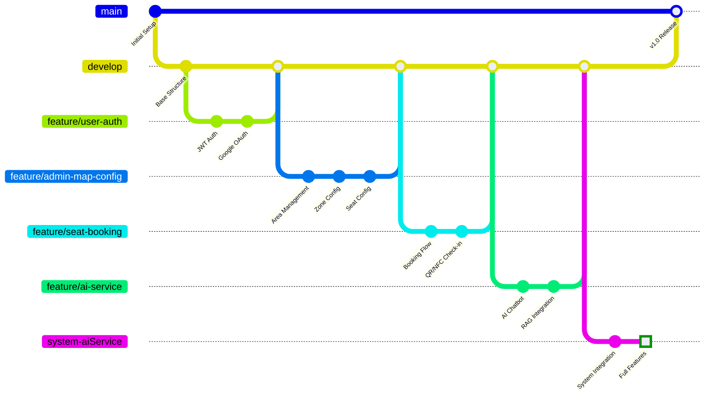
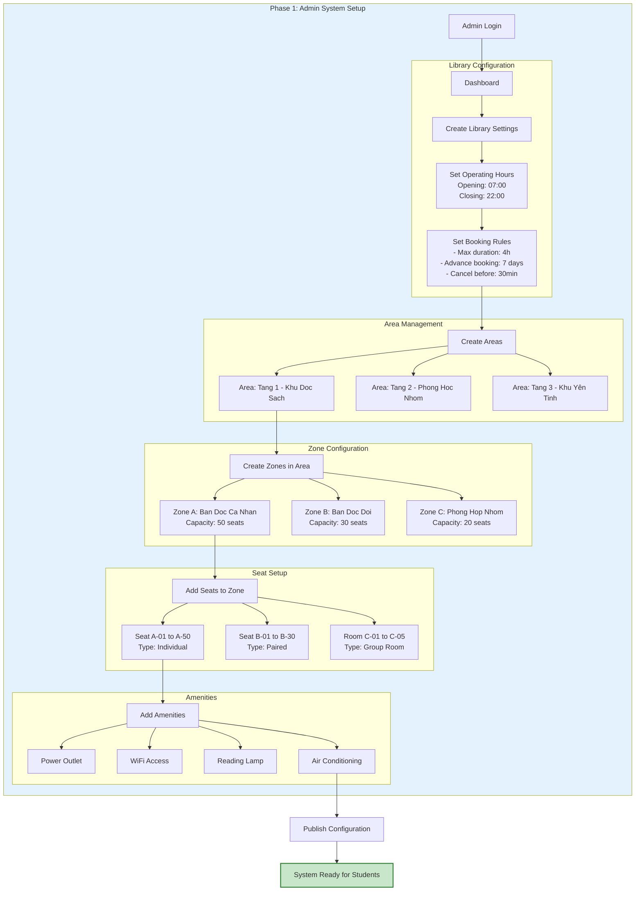
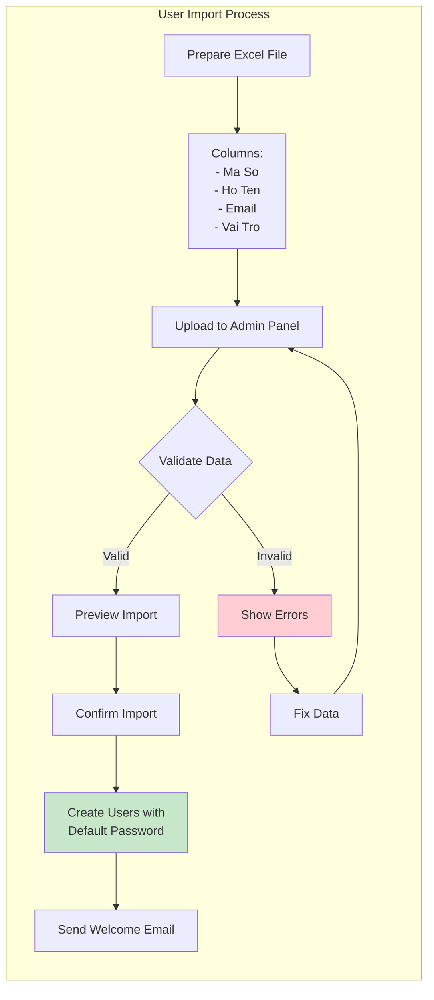
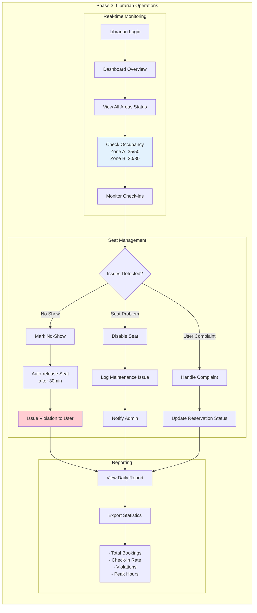
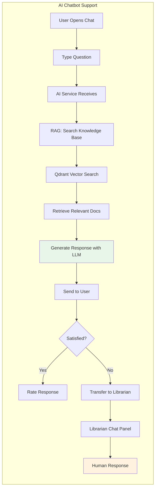
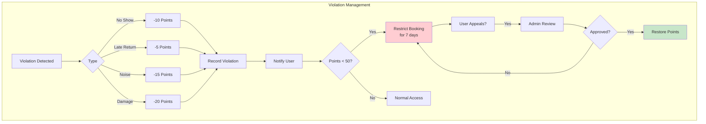
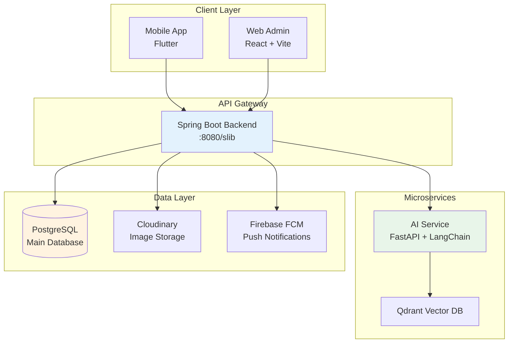

# SLIB System Diagrams

This document contains comprehensive Git Flow and Business Flow diagrams for the SLIB Library Management System.

---

## 1. SLIB Git Flow



### Current Branch Structure

| Branch | Status | Purpose |
|--------|--------|---------|
| `main` | Production | Stable released code |
| `develop` | Integration | Feature integration |
| `system-aiService` | **Active** | Complete system with all features |
| `feature/forgot-password` | PR Open | Password reset functionality |
| `feature/user-deletion` | PR Open | User deletion with confirmation |
| `feature/account-settings` | PR Open | Account settings UI |
| `feature/violation-history` | PR Open | Violation history screen |

### Branch Naming Convention

```
feature/     - New features
fix/         - Bug fixes
hotfix/      - Emergency production fixes
chore/       - Maintenance tasks
docs/        - Documentation updates
```

---

## 2. SLIB Complete Business Flow

### 2.1 System Setup Flow (Admin)



### 2.2 User Import Flow (Admin)



### 2.3 Student Registration & Booking Flow

```mermaid
flowchart TB
    subgraph STUDENT_FLOW["Phase 2: Student Journey"]
        direction TB
        
        subgraph AUTH["Authentication"]
            S1[Open SLIB App] --> S2{Has Account?}
            S2 -->|No| S3[Register with FPT Email]
            S3 --> S4[Google OAuth Login]
            S2 -->|Yes| S4
            S4 --> S5[Verify @fpt.edu.vn Domain]
            S5 -->|Valid| S6[Access Granted]
            S5 -->|Invalid| S7[Registration Denied]
        end
        
        subgraph BROWSE["Browse Library"]
            S6 --> B1[Home Screen]
            B1 --> B2[View Available Areas]
            B2 --> B3[Select Area]
            B3 --> B4[View Zone Map]
            B4 --> B5[See Real-time Availability]
        end
        
        subgraph BOOKING["Booking Process"]
            B5 --> K1[Select Seat]
            K1 --> K2[Choose Time Slot]
            K2 --> K3[Review Booking Details]
            K3 --> K4{Confirm Booking}
            K4 -->|Yes| K5[Create Reservation<br/>Status: PROCESSING]
            K4 -->|No| B5
            K5 --> K6[Payment/Confirm]
            K6 --> K7[Status: BOOKED]
            K7 --> K8[Generate QR Code]
            K8 --> K9[Send Push Notification]
        end
        
        subgraph CHECKIN["Check-in Process"]
            K9 --> C1[Go to Library]
            C1 --> C2[Find Seat Location]
            C2 --> C3{Check-in Method}
            C3 -->|QR Code| C4[Scan QR at Seat]
            C3 -->|NFC| C5[Tap Phone on NFC Tag]
            C4 --> C6[Verify Reservation]
            C5 --> C6
            C6 -->|Match| C7[Status: CONFIRMED<br/>Seat: OCCUPIED]
            C6 -->|No Match| C8[Error: Wrong Seat]
        end
        
        subgraph USAGE["Usage & Checkout"]
            C7 --> U1[Study Session]
            U1 --> U2{Session Complete?}
            U2 -->|Yes| U3[Check-out]
            U2 -->|Extend| U4[Request Extension]
            U4 --> U5{Available?}
            U5 -->|Yes| U1
            U5 -->|No| U3
            U3 --> U6[Status: COMPLETED<br/>Seat: AVAILABLE]
            U6 --> U7[Update User Stats]
        end
    end
    
    style K5 fill:#FFF3E0
    style K7 fill:#E3F2FD
    style C7 fill:#C8E6C9
    style U6 fill:#F3E5F5
```



### 2.4 Librarian Operations Flow



### 2.5 AI Chatbot Support Flow



### 2.6 Violation & Points System



---

## 3. System Architecture Overview



---

## 4. Status Codes Reference

### Reservation Status
| Status | Description | Color |
|--------|-------------|-------|
| `PROCESSING` | Booking created, awaiting confirmation | Orange |
| `BOOKED` | Confirmed, waiting for check-in | Blue |
| `CONFIRMED` | User checked-in | Green |
| `COMPLETED` | Session finished | Gray |
| `CANCELLED` | User cancelled | Red |
| `EXPIRED` | No-show after timeout | Dark Red |

### Seat Status
| Status | Description | Color |
|--------|-------------|-------|
| `AVAILABLE` | Ready for booking | Green |
| `HOLDING` | Temporarily reserved | Yellow |
| `BOOKED` | Reserved for time slot | Blue |
| `OCCUPIED` | Currently in use | Orange |
| `MAINTENANCE` | Under repair | Gray |

---

## File Locations

- Diagrams Source: `doc/SLIB_Diagrams.md`
- Generated images will be in `doc/` folder
