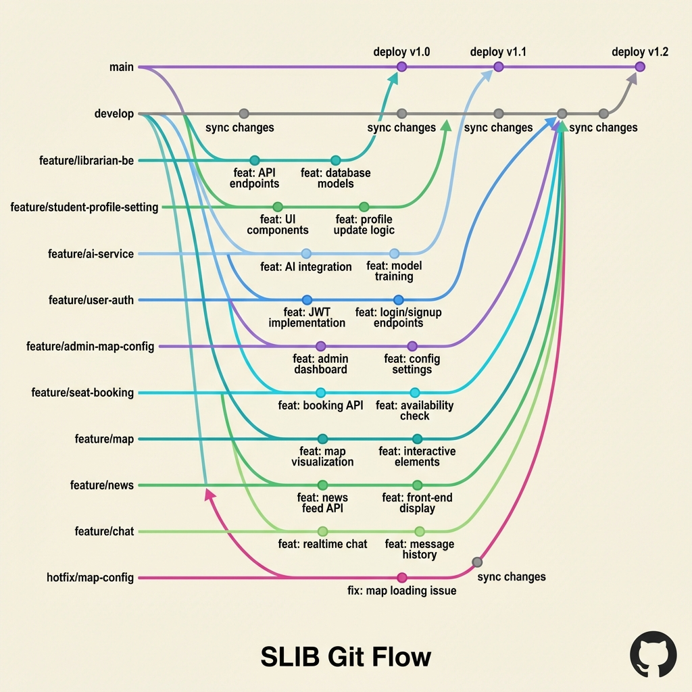
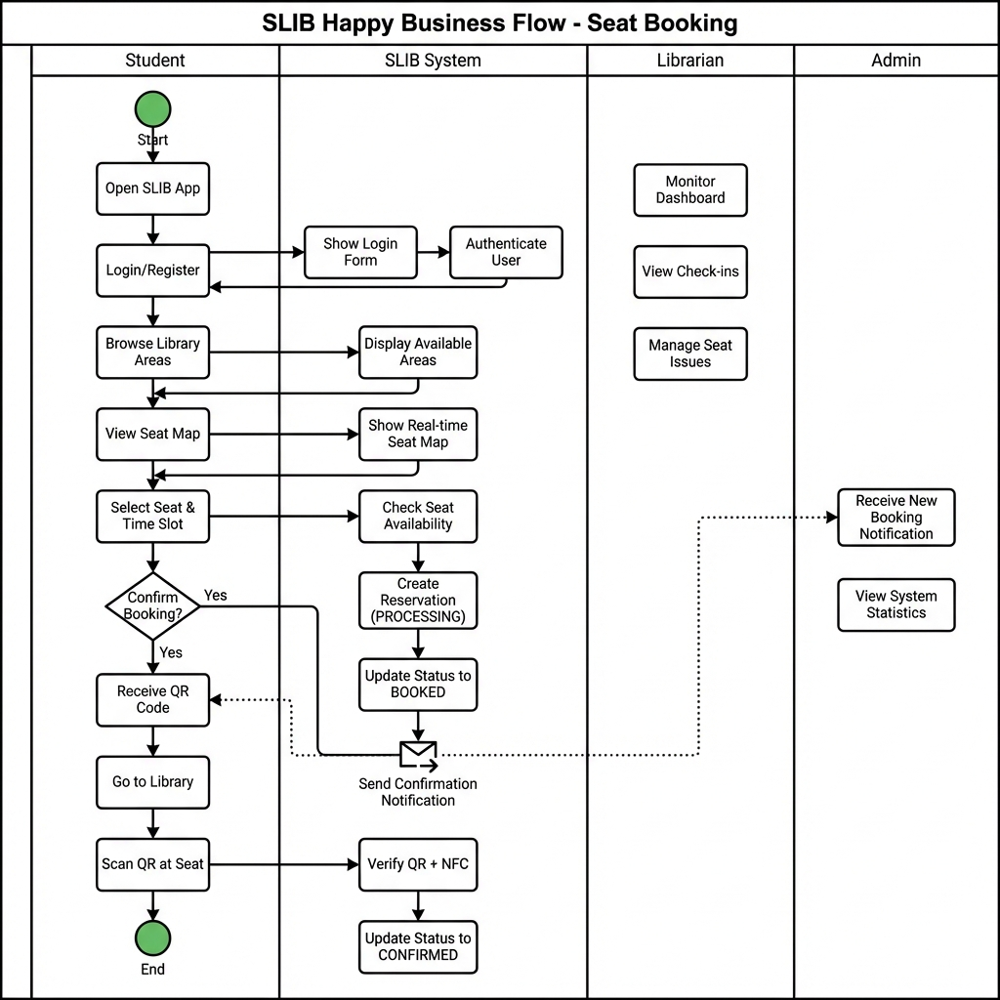

# SLIB System Diagrams

This document contains the Git Flow and Happy Business Flow diagrams for the SLIB Library Management System.

---

## 1. SLIB Git Flow

### Branches Overview

| Branch | Purpose |
|--------|---------|
| `main` | Production branch, contains released code |
| `develop` | Integration branch for features |
| `feature/librarian-be` | Librarian backend features |
| `feature/student-profile-setting` | Student profile management |
| `feature/ai-service` | AI chatbot integration |
| `feature/user-auth` | User authentication (JWT, OAuth) |
| `feature/admin-map-config` | Admin map configuration |
| `feature/seat-booking` | Seat booking functionality |
| `feature/map` | Library map visualization |
| `feature/news` | News and announcements |
| `feature/chat` | Real-time chat support |
| `hotfix/map-config` | Emergency fixes for map issues |

---

## 2. SLIB Happy Business Flow - Seat Booking

### Process Description

**Student Flow:**
1. Open SLIB App
2. Login/Register
3. Browse Library Areas
4. View Seat Map
5. Select Seat & Time Slot
6. Confirm Booking
7. Receive QR Code
8. Go to Library
9. Scan QR at Seat
10. Complete

**System Flow:**
1. Show Login Form → Authenticate User
2. Display Available Areas
3. Show Real-time Seat Map
4. Check Seat Availability
5. Create Reservation (PROCESSING)
6. Update Status to BOOKED
7. Send Confirmation Notification
8. Verify QR + NFC
9. Update Status to CONFIRMED

**Librarian Flow:**
- Monitor Dashboard
- View Check-ins
- Manage Seat Issues

**Admin Flow:**
- Receive New Booking Notification
- View System Statistics

---

## File Locations

- Git Flow Image: `doc/SLIB_Git_Flow.png`
- Business Flow Image: `doc/SLIB_Business_Flow.png`
