# SLIB System — Workflow Diagrams

---

## 3.2 Authentication & Account Management

### 3.2.1 Log in to the System (Google & SLIB Account)

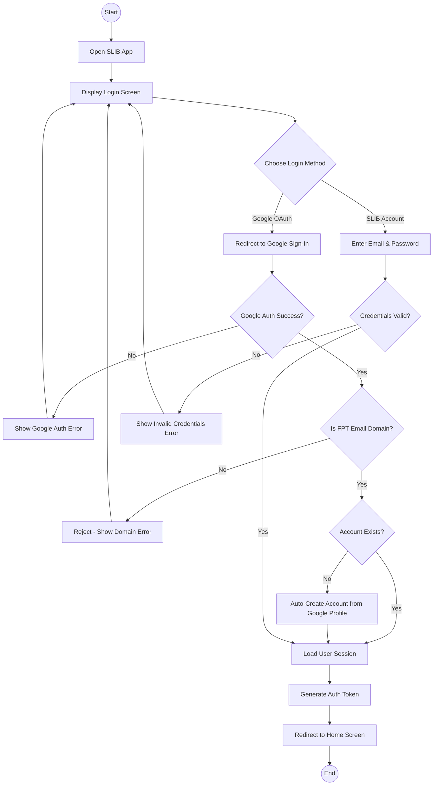

### 3.2.2 Forgot Password

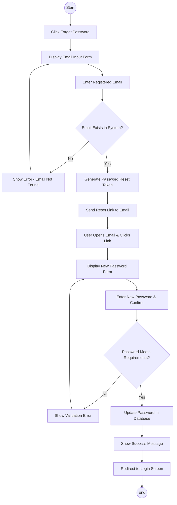

### 3.2.3 View and Change Profile Info

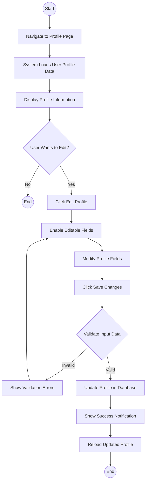

### 3.2.4 Change Password

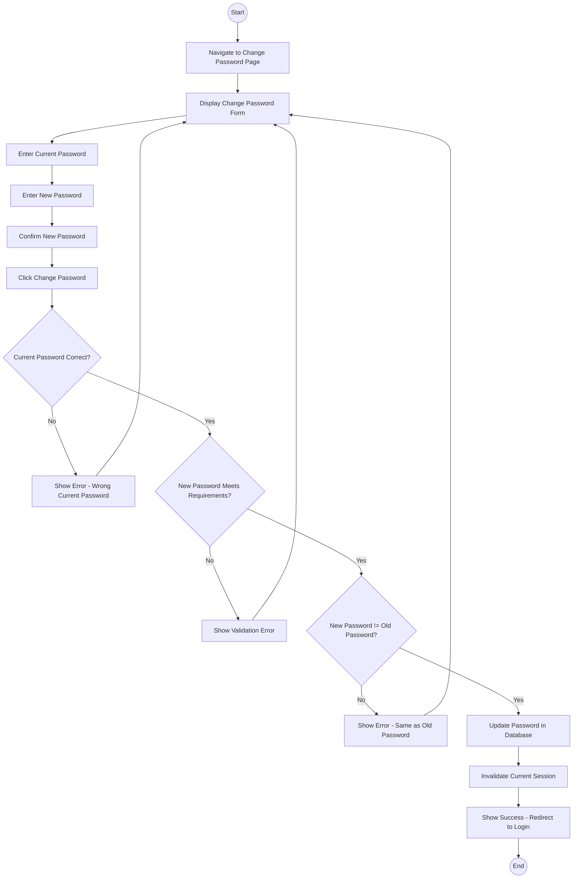

### 3.2.5 Log out

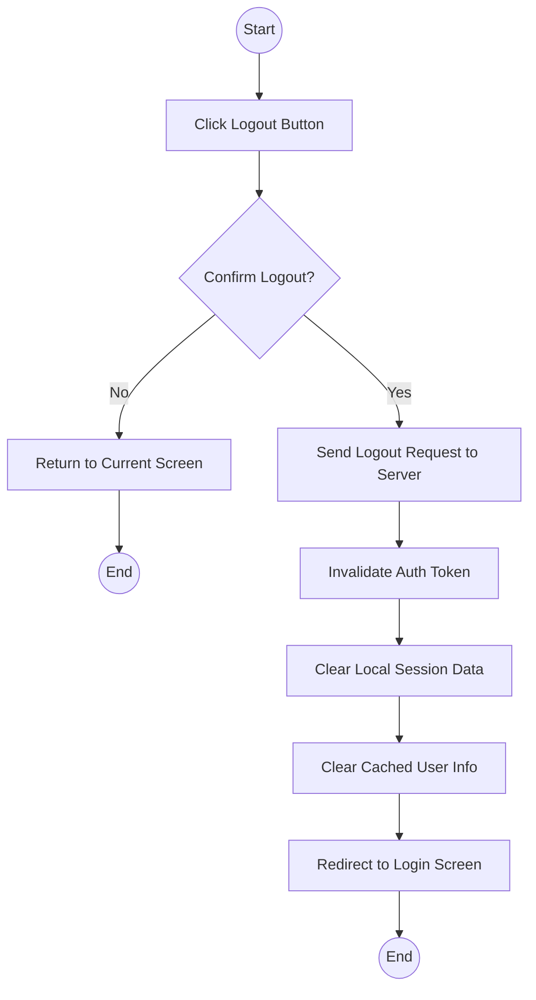

---

## 3.3 General Settings & Information

### 3.3.1 View Personal Barcode & Activity History

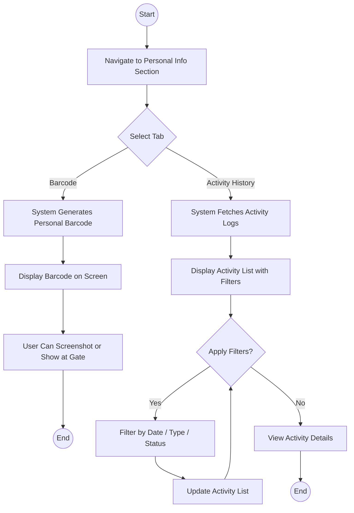

### 3.3.2 Manage Account Settings (Notifications, AI, HCE)

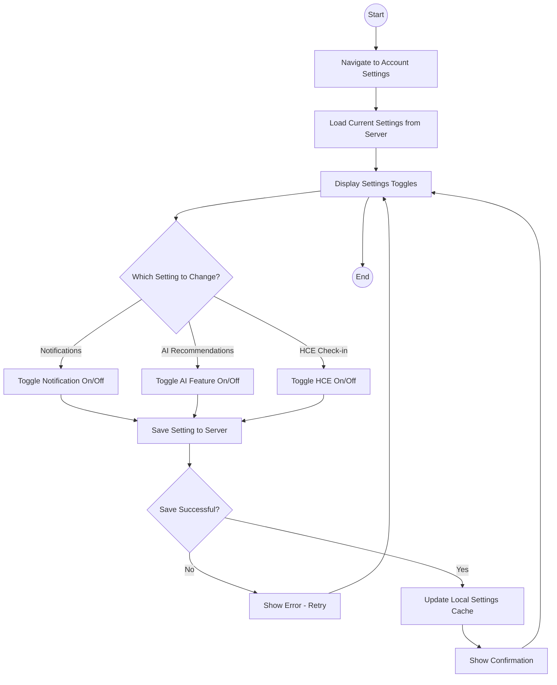

### 3.3.3 View Booking Restriction Status

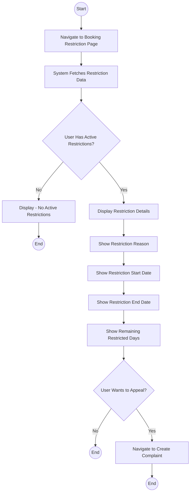

---

## 3.4 Library Access Process

### 3.4.1 Check-in/Check-out via HCE

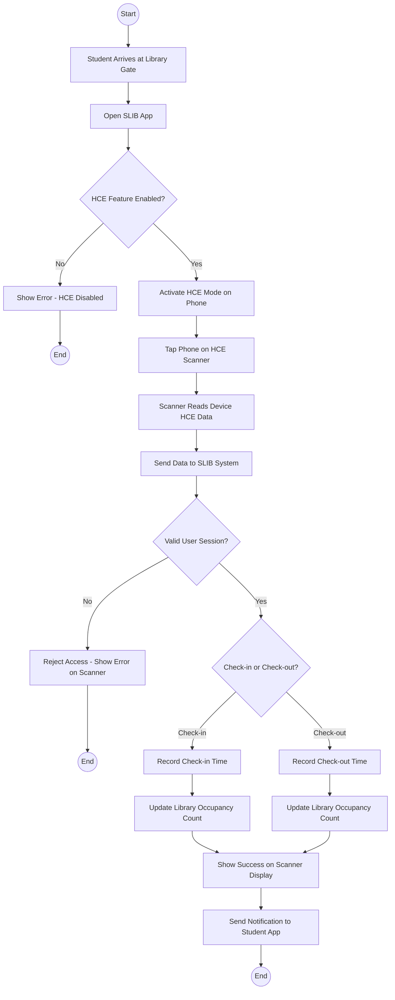

### 3.4.2 Check-in/Check-out via QR Code

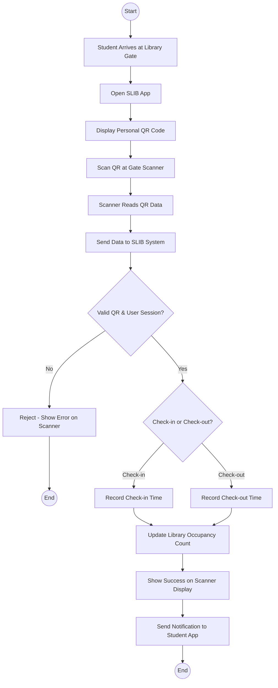

### 3.4.3 View History of Check-ins/Check-outs

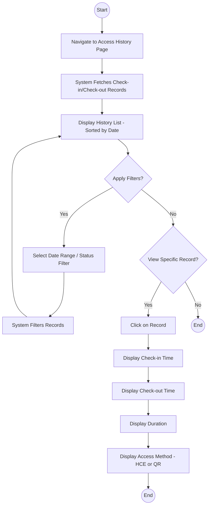

---

## 3.5 Seat Booking & Usage

### 3.5.1 View, Filter and Check Seat Map Density

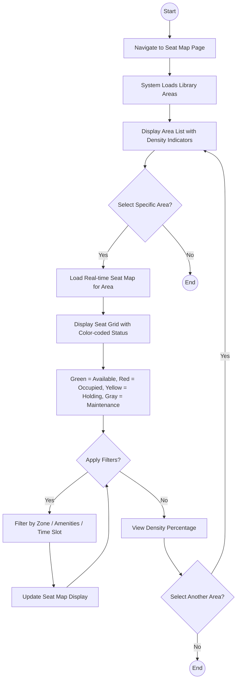

### 3.5.2 Ask AI for Recommending Seat

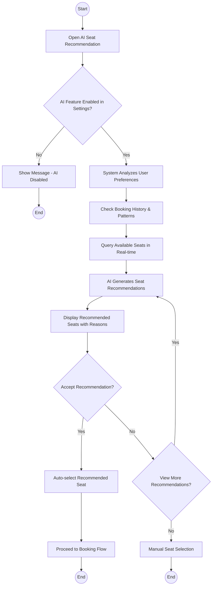

### 3.5.3 Book Seat & Confirm via NFC

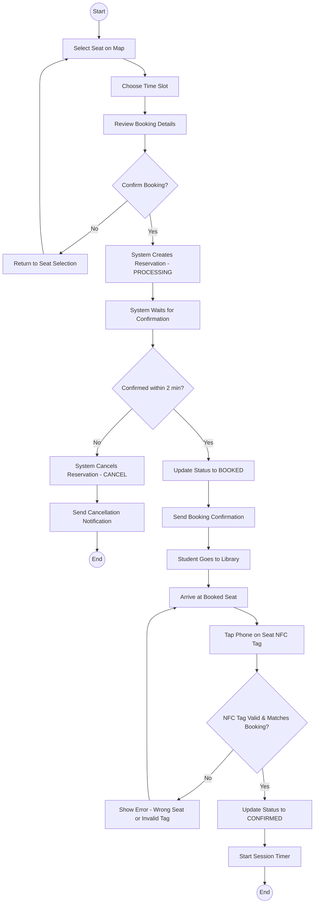

### 3.5.4 View Actual Seat End Time

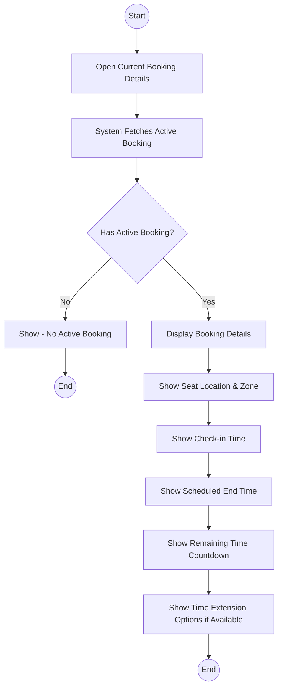

### 3.5.5 Leave Seat via NFC

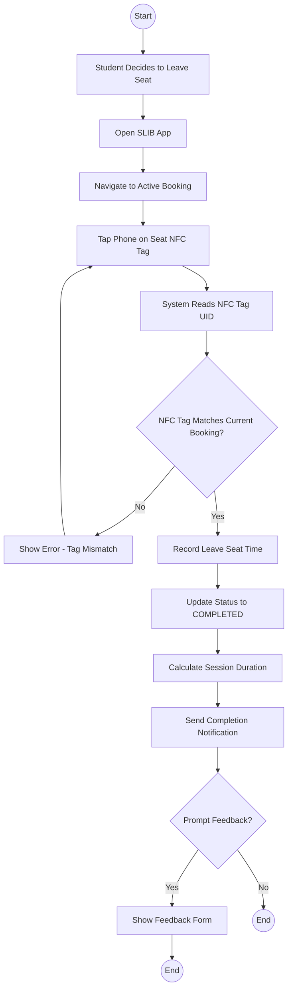

### 3.5.6 Manage Bookings (View History & Cancel)

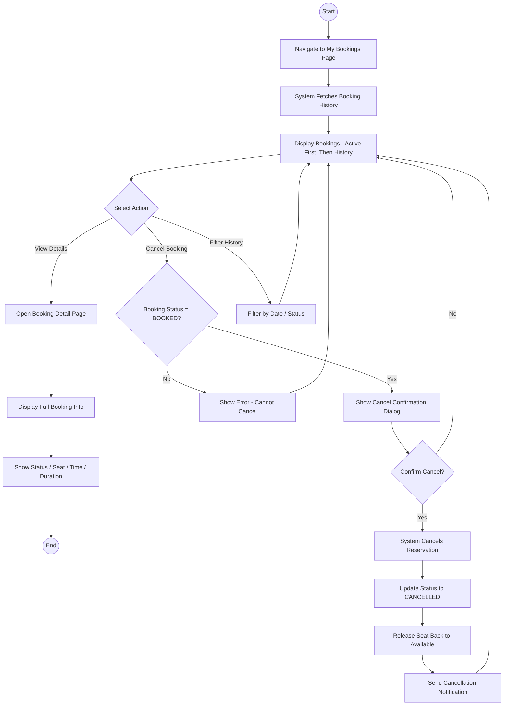

---

## 3.6 Reporting, Feedback & Support

### 3.6.1 View Reputation Score & Point Deductions

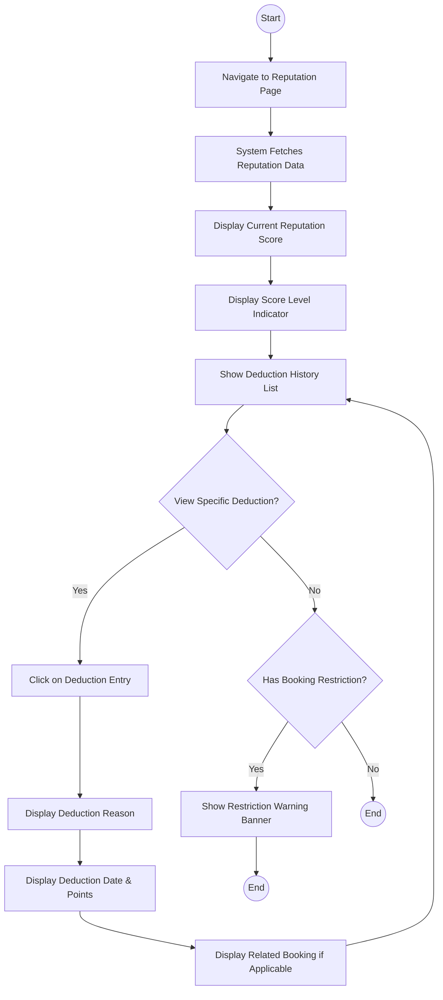

### 3.6.2 Create Complaint & View History

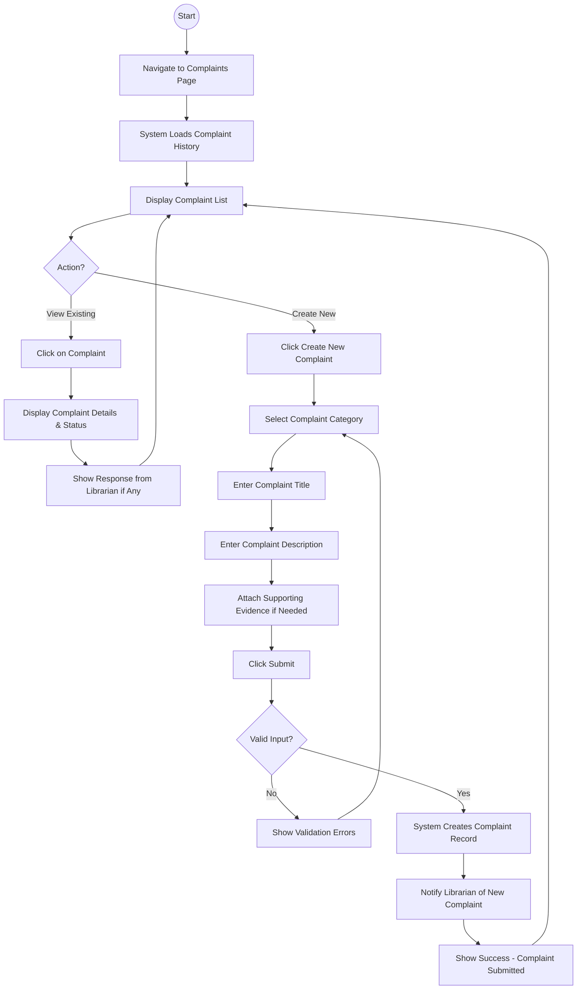

### 3.6.3 Create Seat Status / Violation Report

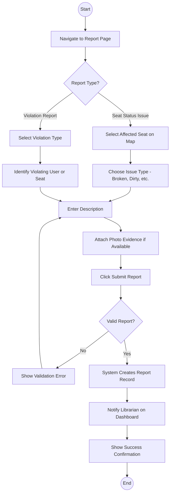

### 3.6.4 Submit Feedback After Check-out

```mermaid
flowchart TD
    Start((Start)) --> A[Session Ends or Check-out Completed]
    A --> B[System Prompts Feedback Form]
    B --> C{User Wants to Give Feedback?}
    C -->|No| D[Dismiss Feedback Prompt]
    D --> End1((End))
    C -->|Yes| E[Display Feedback Form]
    E --> F[Rate Overall Experience - Stars]
    F --> G[Select Feedback Categories]
    G --> H[Enter Additional Comments - Optional]
    H --> I[Click Submit Feedback]
    I --> J[System Saves Feedback Record]
    J --> K[Link Feedback to Booking Session]
    K --> L[Show Thank You Message]
    L --> End2((End))
```

### 3.6.5 Chat with AI & Librarian

```mermaid
flowchart TD
    Start((Start)) --> A[Open Chat Feature]
    A --> B[System Loads Chat History from MongoDB]
    B --> C[Display Chat Interface]
    C --> D[User Types Message]
    D --> E[Send Message to AI Service]
    E --> F[AI Processes via RAG Pipeline]
    F --> G{AI Confident in Answer?}
    G -->|Yes| H[AI Returns Response to User]
    H --> I[Display AI Response in Chat]
    I --> C
    G -->|No| J{Escalation Required?}
    J -->|No| K[AI Returns Best-effort Response]
    K --> I
    J -->|Yes| L[AI Triggers Escalation to Librarian]
    L --> M[Notify Librarian of Escalated Chat]
    M --> N[Librarian Joins Conversation]
    N --> O[Librarian Responds to Student]
    O --> P[Display Librarian Response]
    P --> C
```

### 3.6.6 Send Support Request

```mermaid
flowchart TD
    Start((Start)) --> A[Navigate to Support Page]
    A --> B[Display Support Request Form]
    B --> C[Select Support Category]
    C --> D[Enter Subject]
    D --> E[Enter Detailed Description]
    E --> F[Attach Files if Needed]
    F --> G[Click Submit Request]
    G --> H{Valid Request?}
    H -->|No| I[Show Validation Errors]
    I --> B
    H -->|Yes| J[System Creates Support Ticket]
    J --> K[Assign to Available Librarian]
    K --> L[Send Notification to Librarian]
    L --> M[Send Confirmation to Student]
    M --> N[Show Ticket Number & Status]
    N --> End((End))
```

---

## 3.7 Information Discovery

### 3.7.1 View News, Announcements & New Books

```mermaid
flowchart TD
    Start((Start)) --> A[Navigate to Information Section]
    A --> B{Select Category}
    B -->|News| C[System Fetches Published News]
    C --> D[Display News List - Latest First]
    B -->|Announcements| E[System Fetches Announcements]
    E --> D
    B -->|New Books| F[System Fetches New Book Entries]
    F --> D
    D --> G{Select Item to Read?}
    G -->|Yes| H[Open Detail Page]
    H --> I[Display Full Content]
    I --> J[Show Related Items if Available]
    J --> D
    G -->|No| K{Search or Filter?}
    K -->|Yes| L[Enter Search Query or Apply Filter]
    L --> M[System Returns Filtered Results]
    M --> D
    K -->|No| End((End))
```

### 3.7.2 Manage Notifications

```mermaid
flowchart TD
    Start((Start)) --> A[Navigate to Notifications Page]
    A --> B[System Fetches All Notifications]
    B --> C[Display Notification List - Grouped by Type]
    C --> D{Action?}
    D -->|Read Notification| E[Click on Notification]
    E --> F[Mark as Read]
    F --> G[Display Notification Detail]
    G --> H{Has Deep Link?}
    H -->|Yes| I[Navigate to Related Screen]
    H -->|No| C
    I --> End1((End))
    D -->|Mark All as Read| J[System Marks All Notifications Read]
    J --> C
    D -->|Delete Notification| K[Swipe or Select to Delete]
    K --> L[System Removes Notification]
    L --> C
    D -->|Done| End2((End))
```

---

## 3.8 Facility Monitoring & Control

### 3.8.1 View Real-time Seat Map & Library Access

```mermaid
flowchart TD
    Start((Start)) --> A[Librarian Opens Dashboard]
    A --> B[System Loads Real-time Data via WebSocket]
    B --> C[Display Seat Map with Live Status]
    C --> D[Show Library Access Count - Current Occupancy]
    D --> E[Color-coded Seats Update in Real-time]
    E --> F{Select Specific Area?}
    F -->|Yes| G[Zoom into Selected Area]
    G --> H[Display Zone-level Seat Details]
    H --> I[Show Seat Status, Student Info, Time Remaining]
    I --> F
    F -->|No| J{View Access Log?}
    J -->|Yes| K[Display Recent Check-in/Check-out Events]
    K --> L[Show Student Name, Time, Method]
    L --> End1((End))
    J -->|No| End2((End))
```

### 3.8.2 Search, Filter and View User Bookings

```mermaid
flowchart TD
    Start((Start)) --> A[Librarian Opens Booking Management]
    A --> B[System Loads All Bookings]
    B --> C[Display Booking List with Pagination]
    C --> D{Apply Search/Filter?}
    D -->|Search| E[Enter Student Name or ID]
    E --> F[System Queries Matching Bookings]
    F --> C
    D -->|Filter| G[Select Status / Date Range / Area / Zone]
    G --> F
    D -->|View Details| H[Click on Booking Entry]
    H --> I[Display Full Booking Details]
    I --> J[Show Student Info, Seat, Time, Status History]
    J --> K{Take Action?}
    K -->|Yes| L[Cancel or Release Booking]
    L --> C
    K -->|No| C
    D -->|Done| End((End))
```

### 3.8.3 Release Occupied Seat

```mermaid
flowchart TD
    Start((Start)) --> A[Librarian Identifies Occupied Seat to Release]
    A --> B[Select Seat on Real-time Map or Booking List]
    B --> C[View Current Booking for Seat]
    C --> D[Click Release Seat]
    D --> E[Enter Release Reason]
    E --> F{Confirm Release?}
    F -->|No| G[Cancel Action]
    G --> End1((End))
    F -->|Yes| H[System Updates Booking Status to COMPLETED]
    H --> I[Release Seat to AVAILABLE]
    I --> J[Send Notification to Student]
    J --> K[Log Release Action with Librarian ID]
    K --> L[Update Real-time Seat Map]
    L --> End2((End))
```

---

## 3.9 Incident Verification & Report Management

### 3.9.1 Manage User Violations

```mermaid
flowchart TD
    Start((Start)) --> A[Librarian Opens Violations Panel]
    A --> B[System Loads Violation Records]
    B --> C[Display Violation List with Filters]
    C --> D{Action?}
    D -->|View Details| E[Click on Violation]
    E --> F[Display Violation Type, Date, Student Info]
    F --> G[Show Related Booking & Evidence]
    G --> C
    D -->|Update Status| H[Select Violation to Process]
    H --> I{Decision?}
    I -->|Confirm Violation| J[Apply Reputation Deduction]
    J --> K[Notify Student of Violation]
    K --> C
    I -->|Dismiss Violation| L[Mark as Dismissed]
    L --> M[Log Dismissal Reason]
    M --> C
    D -->|Done| End((End))
```

### 3.9.2 Manage Complaints

```mermaid
flowchart TD
    Start((Start)) --> A[Librarian Opens Complaints Panel]
    A --> B[System Loads Pending Complaints]
    B --> C[Display Complaint List - Sorted by Priority]
    C --> D{Select Complaint}
    D --> E[View Complaint Details]
    E --> F[Read Student Description & Evidence]
    F --> G{Action?}
    G -->|Respond| H[Enter Response Message]
    H --> I[Click Send Response]
    I --> J[System Updates Complaint Status]
    J --> K[Notify Student of Response]
    K --> C
    G -->|Resolve| L[Mark Complaint as Resolved]
    L --> M[Enter Resolution Notes]
    M --> K
    G -->|Escalate| N[Forward to Admin]
    N --> O[System Notifies Admin]
    O --> C
    G -->|Back| C
    C --> End((End))
```

### 3.9.3 Verify Seat Status

```mermaid
flowchart TD
    Start((Start)) --> A[Librarian Receives Seat Status Report]
    A --> B[Open Report Details]
    B --> C[View Reported Seat Issue]
    C --> D[Check Current Seat Status on Map]
    D --> E[Physically Verify Seat if Needed]
    E --> F{Issue Confirmed?}
    F -->|Yes| G[Update Seat Status to MAINTENANCE]
    G --> H[Release Any Active Booking on Seat]
    H --> I[Notify Affected Student]
    I --> J[Log Maintenance Record]
    J --> K[Assign Repair Task if Needed]
    K --> End1((End))
    F -->|No| L[Mark Report as Invalid]
    L --> M[Update Seat Status to AVAILABLE]
    M --> N[Close Report]
    N --> End2((End))
```

### 3.9.4 View Feedbacks

```mermaid
flowchart TD
    Start((Start)) --> A[Librarian Opens Feedback Panel]
    A --> B[System Loads Submitted Feedbacks]
    B --> C[Display Feedback List]
    C --> D{Apply Filters?}
    D -->|Yes| E[Filter by Rating / Date / Area]
    E --> F[System Returns Filtered Results]
    F --> C
    D -->|No| G{View Specific Feedback?}
    G -->|Yes| H[Click on Feedback Entry]
    H --> I[Display Rating, Comments, Related Booking]
    I --> J[View Student Info & Session Details]
    J --> C
    G -->|No| K[View Overall Feedback Statistics]
    K --> L[Display Average Rating, Trends, Charts]
    L --> End((End))
```

---

## 3.10 Content Management (News & Books)

### 3.10.1 Manage New Books (CRUD)

```mermaid
flowchart TD
    Start((Start)) --> A[Librarian Opens Book Management Page]
    A --> B[System Loads Book List]
    B --> C[Display Book List with Search & Filter]
    C --> D{Action?}
    D -->|Create| E[Click Add New Book]
    E --> F[Enter Book Details - Title, Author, ISBN, Description]
    F --> G[Upload Book Cover Image]
    G --> H[Click Save]
    H --> I{Valid Input?}
    I -->|No| J[Show Validation Errors]
    J --> F
    I -->|Yes| K[System Creates Book Record]
    K --> C
    D -->|Read| L[Click on Book Entry]
    L --> M[Display Full Book Details]
    M --> C
    D -->|Update| N[Click Edit on Book]
    N --> O[Modify Book Fields]
    O --> H
    D -->|Delete| P[Click Delete on Book]
    P --> Q{Confirm Delete?}
    Q -->|No| C
    Q -->|Yes| R[System Deletes Book Record]
    R --> C
    D -->|Done| End((End))
```

### 3.10.2 Manage News, Announcements & Categories

```mermaid
flowchart TD
    Start((Start)) --> A[Librarian Opens Content Management]
    A --> B{Select Content Type}
    B -->|News| C[Display News List]
    B -->|Announcements| D[Display Announcement List]
    B -->|Categories| E[Display Category List]
    C --> F{Action?}
    D --> F
    E --> F
    F -->|Create New| G[Click Create]
    G --> H[Enter Title, Content, Category]
    H --> I[Set Publish Status - Draft or Published]
    I --> J[Upload Images if Needed]
    J --> K[Click Save]
    K --> L{Valid?}
    L -->|No| M[Show Validation Errors]
    M --> H
    L -->|Yes| N[System Saves Content]
    N --> B
    F -->|Edit| O[Select Item to Edit]
    O --> H
    F -->|Delete| P[Confirm & Delete Item]
    P --> B
    F -->|Done| End((End))
```

### 3.10.3 Schedule & Save News Drafts

```mermaid
flowchart TD
    Start((Start)) --> A[Librarian Creates or Edits News Article]
    A --> B[Enter News Content]
    B --> C{Publish Option?}
    C -->|Save as Draft| D[System Saves with Status DRAFT]
    D --> E[Article Visible Only to Librarians]
    E --> End1((End))
    C -->|Publish Now| F[System Sets Status to PUBLISHED]
    F --> G[Article Visible to All Users]
    G --> H[Send Notification to Users if Configured]
    H --> End2((End))
    C -->|Schedule Publish| I[Select Publish Date & Time]
    I --> J{Scheduled Time Valid?}
    J -->|No| K[Show Error - Must Be Future Date]
    K --> I
    J -->|Yes| L[System Saves with Status SCHEDULED]
    L --> M[System Auto-publishes at Scheduled Time]
    M --> G
```

---

## 3.11 User Support & Analytics

### 3.11.1 Respond to User Chats & User Support

```mermaid
flowchart TD
    Start((Start)) --> A[Librarian Opens Chat Dashboard]
    A --> B[System Loads Active & Escalated Chats]
    B --> C[Display Chat List - Escalated First]
    C --> D{Select Chat?}
    D -->|Yes| E[Open Chat Conversation]
    E --> F[View Chat History with AI & Student]
    F --> G[Read Student Query & AI Responses]
    G --> H[Type Response Message]
    H --> I[Click Send]
    I --> J[System Delivers Message via WebSocket]
    J --> K[Student Receives Librarian Response]
    K --> L{Issue Resolved?}
    L -->|Yes| M[Mark Chat as Resolved]
    M --> C
    L -->|No| N[Continue Conversation]
    N --> H
    D -->|No| End((End))
```

### 3.11.2 View Analytics Dashboards

```mermaid
flowchart TD
    Start((Start)) --> A[Open Analytics Dashboard]
    A --> B[System Aggregates Data from Database]
    B --> C[Display Dashboard Overview]
    C --> D[Show Key Metrics - Bookings, Access, Occupancy]
    D --> E{Select Analytics Section?}
    E -->|Booking Analytics| F[Display Booking Trends, Peak Hours, Areas]
    E -->|Access Analytics| G[Display Check-in/Check-out Patterns]
    E -->|Seat Utilization| H[Display Seat Usage Rates by Zone]
    E -->|User Analytics| I[Display Active Users, Reputation Distribution]
    F --> J{Change Date Range?}
    G --> J
    H --> J
    I --> J
    J -->|Yes| K[Select New Date Range]
    K --> B
    J -->|No| End((End))
```

### 3.11.3 AI Prioritized Students & Warning System

```mermaid
flowchart TD
    Start((Start)) --> A[Open AI Warning Dashboard]
    A --> B[System Runs AI Analysis on Student Behavior]
    B --> C[Identify At-risk Students - Low Reputation, Violations]
    C --> D[Display Prioritized Student List]
    D --> E[Show Risk Level, Reputation Score, Violation Count]
    E --> F{Take Action on Student?}
    F -->|Yes| G[Select Student]
    G --> H{Action Type?}
    H -->|Send Warning| I[Compose Warning Message]
    I --> J[Send Warning Notification to Student]
    J --> D
    H -->|View Details| K[Open Student Profile & History]
    K --> D
    H -->|Apply Restriction| L[Set Booking Restriction Period]
    L --> M[Notify Student of Restriction]
    M --> D
    F -->|No| End((End))
```

### 3.11.4 Export Analytical Report

```mermaid
flowchart TD
    Start((Start)) --> A[Navigate to Report Export Page]
    A --> B{Select Report Type}
    B -->|Booking Report| C[Configure Booking Report Params]
    B -->|Access Report| D[Configure Access Report Params]
    B -->|Utilization Report| E[Configure Utilization Report Params]
    B -->|User Report| F[Configure User Report Params]
    C --> G[Select Date Range]
    D --> G
    E --> G
    F --> G
    G --> H[Select Format - PDF or Excel]
    H --> I[Click Generate Report]
    I --> J[System Aggregates Data]
    J --> K[System Generates Report File]
    K --> L{Generation Successful?}
    L -->|No| M[Show Error Message]
    M --> B
    L -->|Yes| N[Download Report File]
    N --> End((End))
```

---

## 3.12 System Configuration for Admin

### 3.12.1 Manage Library Operating Rules

```mermaid
flowchart TD
    Start((Start)) --> A[Admin Opens Operating Rules Page]
    A --> B[System Loads Current Rules Configuration]
    B --> C[Display Rules Dashboard]
    C --> D{Select Rule to Manage?}
    D -->|Operating Hours| E[Set Open/Close Times by Day]
    D -->|Booking Rules| F[Set Max Booking Duration, Advance Booking Limit]
    D -->|Session Rules| G[Set Grace Period, Auto-complete Timer]
    D -->|Access Rules| H[Set Max Occupancy, Access Methods]
    E --> I[Modify Rule Values]
    F --> I
    G --> I
    H --> I
    I --> J[Click Save Changes]
    J --> K{Valid Configuration?}
    K -->|No| L[Show Validation Errors]
    L --> I
    K -->|Yes| M[System Updates Rules in Database]
    M --> N[Broadcast Updated Rules to All Services]
    N --> O[Show Success Confirmation]
    O --> C
    D -->|Done| End((End))
```

### 3.12.2 Area Management

```mermaid
flowchart TD
    Start((Start)) --> A[Admin Opens Area Management Page]
    A --> B[System Loads All Library Areas]
    B --> C[Display Area List with Status]
    C --> D{Action?}
    D -->|Create Area| E[Click Add New Area]
    E --> F[Enter Area Name, Floor, Description]
    F --> G[Set Area Capacity & Operating Hours]
    G --> H[Upload Area Image]
    H --> I[Click Save]
    I --> J{Valid?}
    J -->|No| K[Show Validation Errors]
    K --> F
    J -->|Yes| L[System Creates Area Record]
    L --> C
    D -->|Edit Area| M[Select Area to Edit]
    M --> F
    D -->|Toggle Status| N[Enable or Disable Area]
    N --> O[System Updates Area Status]
    O --> P[Update Seat Map Visibility]
    P --> C
    D -->|Delete Area| Q[Confirm Delete - Must Have No Active Bookings]
    Q --> C
    D -->|Done| End((End))
```

### 3.12.3 Zone & Attribute Management

```mermaid
flowchart TD
    Start((Start)) --> A[Admin Opens Zone Management]
    A --> B[Select Parent Area]
    B --> C[System Loads Zones for Area]
    C --> D[Display Zone List with Attributes]
    D --> E{Action?}
    E -->|Create Zone| F[Enter Zone Name, Position, Type]
    F --> G[Define Zone Attributes - Amenities]
    G --> H[Set Zone Capacity]
    H --> I[Click Save]
    I --> J{Valid?}
    J -->|No| K[Show Errors]
    K --> F
    J -->|Yes| L[System Creates Zone]
    L --> D
    E -->|Edit Zone| M[Select Zone to Edit]
    M --> F
    E -->|Manage Attributes| N[Open Attribute Configuration]
    N --> O[Add/Edit/Remove Amenities - Power, WiFi, etc.]
    O --> P[Save Attribute Changes]
    P --> D
    E -->|Delete Zone| Q[Confirm & Delete Zone]
    Q --> D
    E -->|Done| End((End))
```

### 3.12.4 Seat Management

```mermaid
flowchart TD
    Start((Start)) --> A[Admin Opens Seat Management]
    A --> B[Select Area & Zone]
    B --> C[System Loads Seats for Zone]
    C --> D[Display Seat List / Map View]
    D --> E{Action?}
    E -->|Add Seat| F[Click Add Seat]
    F --> G[Enter Seat Label, Position on Map]
    G --> H[Assign Seat Attributes]
    H --> I[Click Save]
    I --> J{Valid?}
    J -->|No| K[Show Errors]
    K --> G
    J -->|Yes| L[System Creates Seat]
    L --> D
    E -->|Edit Seat| M[Select Seat]
    M --> G
    E -->|Change Status| N[Set Seat to Available, Maintenance, or Disabled]
    N --> O[System Updates Seat Status]
    O --> P{Active Booking on Seat?}
    P -->|Yes| Q[Notify Student & Cancel Booking]
    Q --> D
    P -->|No| D
    E -->|Delete Seat| R[Confirm & Delete Seat]
    R --> D
    E -->|Done| End((End))
```

---

## 3.13 User Management for Admin

### 3.13.1 View and Manage Users Status

```mermaid
flowchart TD
    Start((Start)) --> A[Open User Management Page]
    A --> B[System Loads Paginated Users]
    B --> C[Display User List with Filters]
    C --> D[Search by Name / Email / User Code]
    D --> E[Apply Filters - Role, Status]
    E --> F[Sort Results]
    F --> G[Select a User]
    G --> H[System Loads User Details]
    H --> I[View User Details]
    I --> J{Decide Action?}
    J -->|No action| K[Close Details]
    K --> End1((End))
    J -->|Need status change| L{Choose Action?}
    L -->|Lock| M[Enter Lock Reason]
    M --> N[Confirm Lock]
    L -->|Activate / Unlock| O[Confirm Action]
    N --> P[System Validates Admin Action]
    O --> P
    P --> Q[Update User Status]
    Q --> R[Save Lock Reason if Provided]
    R --> S[Refresh User List]
    S --> T[Show Updated Status]
    T --> End2((End))
```

### 3.13.2 Import Student and Teacher via File

```mermaid
flowchart TD
    Start((Start)) --> A[Admin Opens Import Users Page]
    A --> B[Display Import Instructions & Template Download]
    B --> C[Admin Downloads CSV/Excel Template]
    C --> D[Admin Fills Template with User Data]
    D --> E[Click Upload File]
    E --> F[Select File from Device]
    F --> G[System Validates File Format]
    G --> H{Format Valid?}
    H -->|No| I[Show Format Error]
    I --> E
    H -->|Yes| J[System Parses File Contents]
    J --> K[Validate Each Row - Email, Name, Role]
    K --> L{Validation Errors Found?}
    L -->|Yes| M[Display Error Report - Row by Row]
    M --> N{Fix & Retry?}
    N -->|Yes| D
    N -->|No| End1((End))
    L -->|No| O[Show Preview - Number of Users to Import]
    O --> P{Confirm Import?}
    P -->|No| End2((End))
    P -->|Yes| Q[System Creates User Accounts in Batch]
    Q --> R[Generate Temporary Passwords or Send Invites]
    R --> S[Display Import Success Summary]
    S --> End3((End))
```

### 3.13.3 Add User to the System

```mermaid
flowchart TD
    Start((Start)) --> A[Admin Clicks Add New User]
    A --> B[Display User Creation Form]
    B --> C[Enter Full Name]
    C --> D[Enter Email Address]
    D --> E[Select Role - Student, Librarian, Admin]
    E --> F[Enter Additional Info - Student ID, Department]
    F --> G[Click Create User]
    G --> H{Validate Input}
    H -->|Email Already Exists| I[Show Error - Duplicate Email]
    I --> B
    H -->|Invalid Fields| J[Show Validation Errors]
    J --> B
    H -->|Valid| K[System Creates User Account]
    K --> L[Generate Temporary Password]
    L --> M[Send Welcome Email with Credentials]
    M --> N[Show Success - User Created]
    N --> End((End))
```

---

## 3.14 Hardware Configuration for Admin

### 3.14.1 Manage HCE Scan Stations

```mermaid
flowchart TD
    Start((Start)) --> A[Admin Opens HCE Station Management]
    A --> B[System Loads Registered HCE Stations]
    B --> C[Display Station List with Online/Offline Status]
    C --> D{Action?}
    D -->|Add Station| E[Click Register New Station]
    E --> F[Enter Station Name, Location, MAC Address]
    F --> G[Select Gate Assignment - Entry or Exit]
    G --> H[Click Register]
    H --> I{Valid?}
    I -->|No| J[Show Errors]
    J --> F
    I -->|Yes| K[System Registers Station]
    K --> C
    D -->|Edit Station| L[Select Station to Edit]
    L --> F
    D -->|Deactivate| M[Toggle Station Active/Inactive]
    M --> N[System Updates Station Status]
    N --> C
    D -->|View Logs| O[Open Station Activity Log]
    O --> P[Display Recent Scan Events]
    P --> C
    D -->|Delete| Q[Confirm & Remove Station]
    Q --> C
    D -->|Done| End((End))
```

### 3.14.2 Manage NFC Tag UID Mapping

```mermaid
flowchart TD
    Start((Start)) --> A[Admin Opens NFC Tag Management]
    A --> B[System Loads NFC Tag Mappings]
    B --> C[Display Tag List - UID, Assigned Seat, Status]
    C --> D{Action?}
    D -->|Add Mapping| E[Enter NFC Tag UID]
    E --> F[Select Target Seat from Map]
    F --> G[Click Save Mapping]
    G --> H{UID Already Mapped?}
    H -->|Yes| I[Show Error - Duplicate UID]
    I --> E
    H -->|No| J[System Creates Mapping]
    J --> C
    D -->|Edit Mapping| K[Select Tag to Reassign]
    K --> L[Select New Target Seat]
    L --> G
    D -->|Delete Mapping| M[Confirm & Remove Mapping]
    M --> C
    D -->|Test Tag| N[Initiate NFC Tag Test]
    N --> O[System Verifies Tag Read/Write]
    O --> P[Display Test Result]
    P --> C
    D -->|Done| End((End))
```

### 3.14.3 Manage Kiosk

```mermaid
flowchart TD
    Start((Start)) --> A[Open Kiosk Management Page]
    A --> B[System Loads Kiosk List]
    B --> C[View Kiosk List]
    C --> D{Add New or Select Existing?}
    D -->|Add New| E[Enter Kiosk Information]
    D -->|Select Existing| F[Edit Kiosk Information]
    E --> G[Save Configuration]
    F --> G
    G --> H[System Validates Kiosk Information]
    H --> I[Save Kiosk Configuration]
    I --> J[Generate Activation Code]
    J --> K[Store Activation Metadata]
    K --> L[Send / Use Activation Code for Device Setup]
    L --> M[Kiosk Opens Activation Screen]
    M --> N[Kiosk Enters Activation Code]
    N --> O[Kiosk Sends Activation Request]
    O --> P[System Validates Activation Code]
    P --> Q[System Issues Device Token]
    Q --> R[Kiosk Receives Device Token]
    R --> S[Kiosk Registers Successfully]
    S --> T[System Updates Kiosk Status to Active]
    T --> U[Kiosk Sends Heartbeat]
    U --> V[System Receives Heartbeat / Activity]
    V --> W[Update Last Active Time]
    W --> X[Save Device Heartbeat / Activity]
    X --> Y[Update Kiosk Online / Offline Status]
    Y --> Z[Display Current Kiosk Status]
    Z --> AA[Admin Monitors Kiosk Status]
    AA --> End((End))
```

---

## 3.15 AI & Reputation Configuration for Admin

### 3.15.1 Configure Reputation Rules & Deducted Points

```mermaid
flowchart TD
    Start((Start)) --> A[Open Reputation Rules Page]
    A --> B[System Loads Reputation Rules]
    B --> C[Display Rules List]
    C --> D{Select Existing or Add New?}
    D -->|Select Existing| E[Select Rule to Edit]
    D -->|Add New| F[Click Add New Rule]
    E --> G[Enter Rule Information]
    F --> G
    G --> H[Set Rule Code]
    H --> I[Set Rule Name]
    I --> J[Set Deducted / Rewarded Points]
    J --> K[Set Rule Type]
    K --> L[Enable or Disable Rule]
    L --> M[Save Rule]
    M --> N[System Validates Rule Data]
    N --> O{Validation Passed?}
    O -->|No| P[Show Validation Error]
    P --> G
    O -->|Yes| Q[Check Unique Rule Code]
    Q --> R{Rule Code Unique?}
    R -->|No| S[Show Duplicate Code Error]
    S --> H
    R -->|Yes| T[Save Rule to Database]
    T --> U[Update Active Status]
    U --> V[Apply Rule to Reputation Engine]
    V --> W[Show Save Result]
    W --> End((End))
```

### 3.15.2 Manage AI Materials & Knowledge Stores

```mermaid
flowchart TD
    Start((Start)) --> A[Admin Opens AI Knowledge Management]
    A --> B[System Loads Knowledge Store Index from Qdrant]
    B --> C[Display Material List with Status]
    C --> D{Action?}
    D -->|Upload Material| E[Click Upload New Material]
    E --> F[Select Document File - PDF, DOCX, TXT]
    F --> G[Enter Material Title & Category]
    G --> H[Click Upload & Process]
    H --> I[System Extracts Text Content]
    I --> J[System Generates Vector Embeddings]
    J --> K[System Stores Vectors in Qdrant]
    K --> L[Show Upload Success]
    L --> C
    D -->|Delete Material| M[Select Material to Delete]
    M --> N{Confirm Delete?}
    N -->|No| C
    N -->|Yes| O[System Removes Vectors from Qdrant]
    O --> P[Delete Material Record]
    P --> C
    D -->|View Material| Q[Click on Material Entry]
    Q --> R[Display Material Content & Metadata]
    R --> C
    D -->|Re-index| S[Click Re-index All Materials]
    S --> T[System Rebuilds Vector Store]
    T --> C
    D -->|Done| End((End))
```

### 3.15.3 Test AI Chat

```mermaid
flowchart TD
    Start((Start)) --> A[Admin Opens AI Test Interface]
    A --> B[Display Chat Test Console]
    B --> C[Enter Test Query]
    C --> D[Click Send]
    D --> E[System Sends Query to AI Service]
    E --> F[AI Service Performs RAG Retrieval]
    F --> G[AI Generates Response]
    G --> H[Display AI Response]
    H --> I[Show Retrieved Context Sources]
    I --> J[Show Confidence Score]
    J --> K{Satisfactory Response?}
    K -->|No| L[Adjust AI Parameters if Needed]
    L --> C
    K -->|Yes| M{Test Another Query?}
    M -->|Yes| C
    M -->|No| End((End))
```

---

## 3.16 System Maintenance for Admin

### 3.16.1 View System Overview & Logs

```mermaid
flowchart TD
    Start((Start)) --> A[Admin Opens System Overview Page]
    A --> B[System Collects Health Metrics]
    B --> C[Display System Status Dashboard]
    C --> D[Show Service Status - Backend, AI, Redis, DB]
    D --> E[Show Resource Usage - CPU, Memory, Storage]
    E --> F{View Detailed Logs?}
    F -->|Yes| G[Select Service or Log Category]
    G --> H[System Fetches Log Entries]
    H --> I[Display Log List with Timestamps]
    I --> J{Filter Logs?}
    J -->|Yes| K[Filter by Level, Date, Service]
    K --> H
    J -->|No| L{View Specific Log Entry?}
    L -->|Yes| M[Click on Log Entry]
    M --> N[Display Full Log Details & Stack Trace]
    N --> I
    L -->|No| End1((End))
    F -->|No| End2((End))
```

### 3.16.2 Configure System Notifications

```mermaid
flowchart TD
    Start((Start)) --> A[Admin Opens Notification Configuration]
    A --> B[System Loads Notification Templates & Rules]
    B --> C[Display Notification Configuration Panel]
    C --> D{Action?}
    D -->|Edit Template| E[Select Notification Template]
    E --> F[Modify Template Title & Body]
    F --> G[Set Template Variables]
    G --> H[Click Save Template]
    H --> C
    D -->|Configure Triggers| I[Select Notification Type]
    I --> J[Set Trigger Conditions - Timing, Events]
    J --> K[Enable/Disable Trigger]
    K --> L[Save Trigger Configuration]
    L --> C
    D -->|Configure Channels| M[Set Push Notification Settings]
    M --> N[Configure Firebase Push Parameters]
    N --> O[Save Channel Settings]
    O --> C
    D -->|Test Notification| P[Select Template & Target User]
    P --> Q[Send Test Notification]
    Q --> R[Display Send Result]
    R --> C
    D -->|Done| End((End))
```

### 3.16.3 Backup Data Management (Manual & Auto)

```mermaid
flowchart TD
    Start((Start)) --> A[Admin Opens Backup Management Page]
    A --> B[System Loads Backup History & Schedule]
    B --> C[Display Backup Dashboard]
    C --> D{Action?}
    D -->|Manual Backup| E[Click Create Manual Backup]
    E --> F{Select Backup Scope}
    F -->|Full Backup| G[System Backs Up All Databases]
    F -->|Partial Backup| H[Select Specific Databases/Tables]
    H --> G
    G --> I[System Compresses Backup Files]
    I --> J[Store Backup to Configured Storage]
    J --> K[Show Backup Success with Size & Duration]
    K --> C
    D -->|Configure Auto Backup| L[Set Backup Schedule - Daily, Weekly]
    L --> M[Set Retention Policy - Keep N Backups]
    M --> N[Set Storage Location]
    N --> O[Save Auto Backup Configuration]
    O --> C
    D -->|Restore Backup| P[Select Backup to Restore]
    P --> Q[Show Restore Warning]
    Q --> R{Confirm Restore?}
    R -->|No| C
    R -->|Yes| S[System Restores from Backup]
    S --> T[Verify Data Integrity]
    T --> U[Show Restore Result]
    U --> C
    D -->|Delete Backup| V[Select & Confirm Delete Old Backup]
    V --> C
    D -->|Done| End((End))
```
